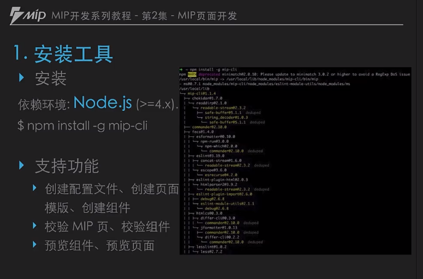
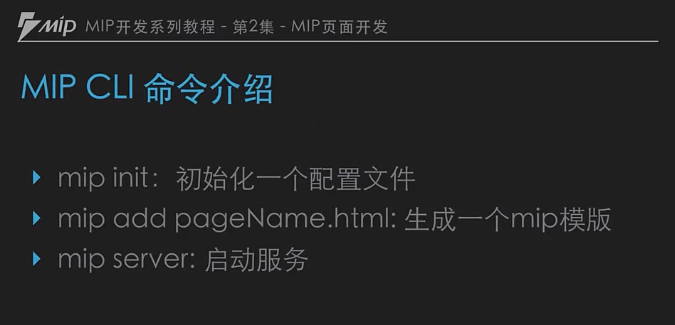

# MIP 页面开发

1.页面规范  
2.页面开发  
3.效验  
4.预览  

## 1.MIP HTML 使用规范 
规范文档：https://www.mipengine.org/doc/2-tech/1-mip-html.html

### Canonical 使用规范  
页面使用 MIP 改造之后 用 Canonical 进行关联，继承 HTML5 的页面权重， HTML5 指向 MIP ,MIP 指向 HTML5
https://www.mipengine.org/doc/2-tech/5-show-your-page.html

总计：页面规范主要讲 MIP HTML 的声明方式，html5 页面和 MIP 页面进行关联，MIP HTML 禁止使用对页面性能以及安全有较大影响的标签，请将其替换为 MIP 的特有标签（例如:将img标签替换为mip-img  

HTML 属性
MIP HTML 中所有 on 开头的属性都不允许使用，如：onclick，onmouseover。
MIP HTML 中允许使用 on 属性。
MIP HTML 中不允许使用 style 属性

> 提示： MIP 校验工具地址：https://www.mipengine.org/validator/validate

## 2. 页面开发
1. 安装工具
2. 构造开发页面
3. 初始化配置
4. 新建 MIP 页面
5. 编辑 MIP 页面

## 1.安装工具
### 1.1 MIP 安装

### 1.2 MIP 命令介绍

## 2.构造开发页面

###  2.1 安装MIP  
> 命令 ：   
        npm install -g mip-cli -d

如果出现： npm WARN deprecated minimatch@2.0.10: Please update to minimatch 3.0.2 or higher to

解决方法：  
升级minimatch到3.0.2  

    npm update minimatch@3.0.2
    npm update -d

然后继续安装：  

    npm install -g mip-cli -d

如果没有把报错：  

    mip -V

初始化项目：

    mip init # 会生成一个 mip.config 的页面

创建页面：

    mip add index.html

## 3.效验 

效验网址：https://www.mipengine.org/validator/validate

## 4.预览
线上网址(砂锅面下)：https://www.mipengine.org/validator/preview

总结：使用 MIP 命令行工具可以创建 MIP 页面，使用 mip server 命令 打开预览页面
