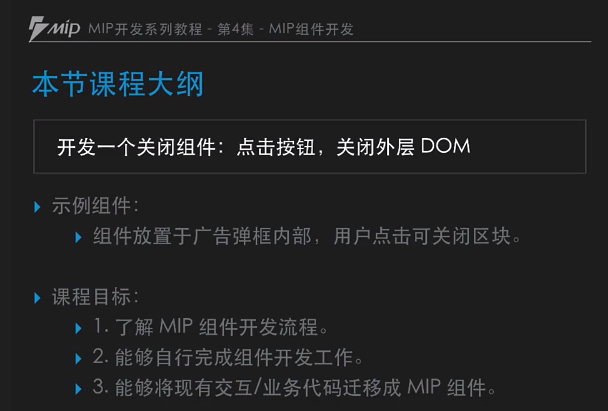
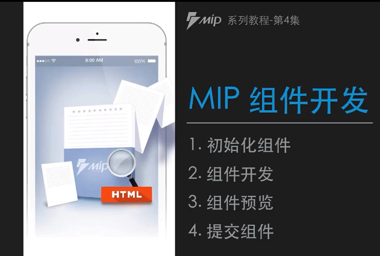
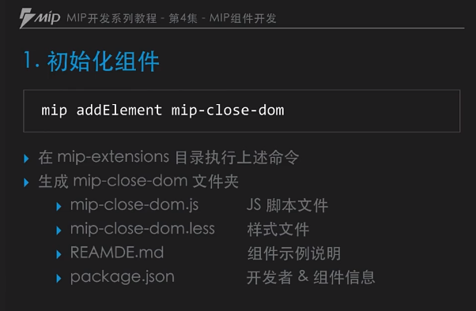
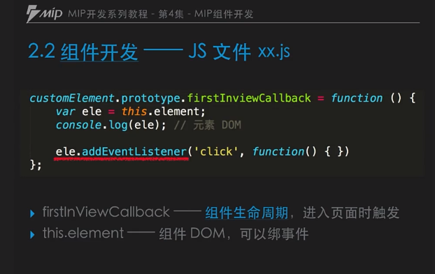
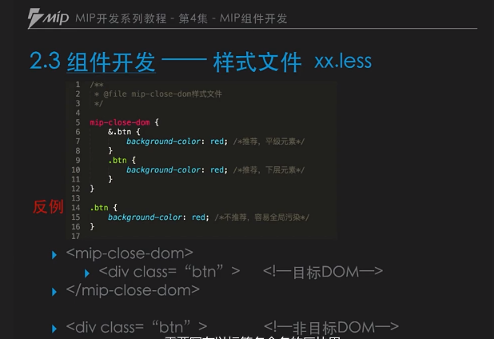
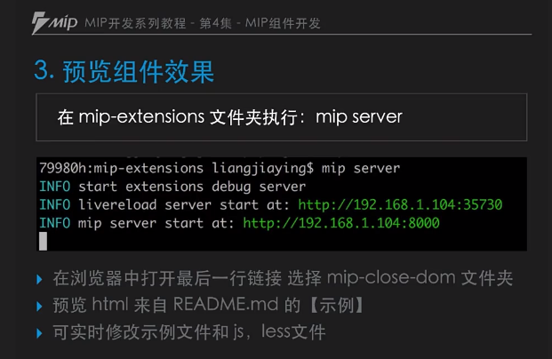
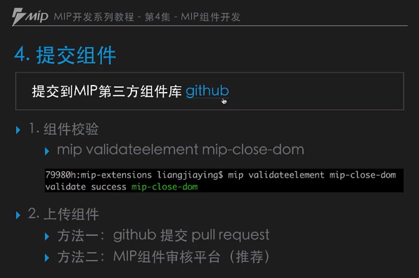
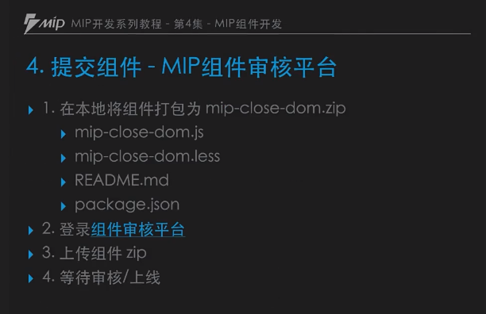

# 4.MIP组件开发



## 1.MIP 组件开发流程


### 1.1 初始化组件模板

官方教程：https://www.cnblogs.com/mipengine/p/mip_cli_3_extension.html



   
    mip addElement mip-close-dom # 需要在 mip-extensions 目录执行
目录：C:\Users\HX\AppData\Roaming\npm

### 1.2 组件开发



#### 1.2.1 描写插件的配置信息 README.md


#### 1.2.2 初始化 js 效果如下：
````js
define(function (require) {

    var customElement = require('customElement').create();

    /**
     * 第一次进入可视区回调，只会执行一次
     */
    customElement.prototype.firstInviewCallback = function () {
        var ele = this.element; // 获取当前元素的 dom
        console.log(ele);

        // 这个 DOM 可以用来绑定事件
        ele.addEventListener('click',function () {

        });
    };

    return customElement;
});
````

本次实例：
````js
define(function (require) {

    var customElement = require('customElement').create();

    /**
     * 第一次进入可视区回调，只会执行一次
     */
    customElement.prototype.firstInviewCallback = function () {
        var ele = this.element; // 获取当前元素的 dom
        console.log(ele);

        // 这个 DOM 可以用来绑定事件
        ele.addEventListener('click',function () {
            var target = ele.parentElement;
            target.parentElement.removeChild(target);
        },false);
        // 鼠标放上去的样式
        ele.addEventListener('mousedown',function () {
            ele.className += ' touchdown'; // 不直接删除，而是添加一个样式
        });

        // 鼠标离开的时候，去掉样式
        ele.addEventListener('mouseup',function () {
            ele.className = ele.className.replace(' touchdown','');
        });
    };

    return customElement;
});
````

#### 1.2.3 less 样式编写



编写 less
````css
mip-alert {
    // CSS 需要写在这里面
   
}
````


### 1.3 组件信息文件 package.json
````json
{
    "name": "mip-alert",
    "version": "1.0.0",
    "description": "组件介绍",
    "contributors": [
        {
            "name": "qucheng",
            "email": "851091009@qq.com"
        }
    ],
    "engines": {
        "mip": ">=1.1.0"
    }
}
````

### 1.4 组件预览


    mip server

### 1.5 提交组件



    mip validateelement 组件名

项目打包到项目组件平台：


组件审核的平台：
https://www.mipengine.org/platform/mip#/

