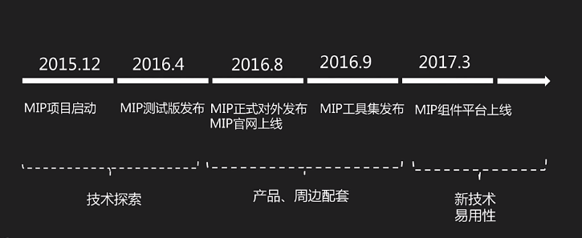
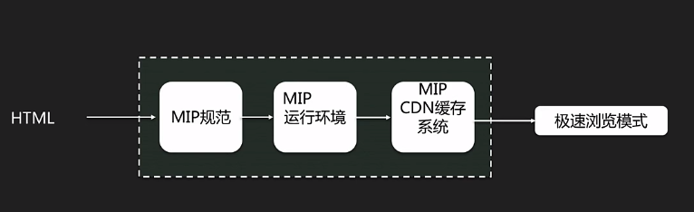

# 初识MIP

1.百度在搜索结果会给MIP的页面加上闪电图标，表示这个页面可以快速的打开

## MIP 迭代的时间  

## MIP 加速原理？  

图片优化：  
默认浏览器打开网页是一次加载全部的图片，其实在可视区域的图片是可以优先加载的，不可视图片是没有必要优先加载的，MIP 提供一套加载机制，可以控制图片加顺序和图片加载的流程

## MIP 学习资源：

* 官网：https://www.mipengine.org  
    MIP 规范，组件API
    
* 博客：https://www.cnblogs.com/mipengine/  
    MIP相关的文章介绍、教程集合
* Github：https://github.com/mipengine/  
    MIP 源代码及其讨论的地方

## MIP开发准备
* 目标：学会搭建 MIP 的开发环境  
* 依赖：nodejs(>=4.x)
* 方法：[sudo] npm install -g mip-cli
* 是否安装成功 mip --version
* http://www.cnblogs.com/mipengine/p/mip_cli_1_install.html

