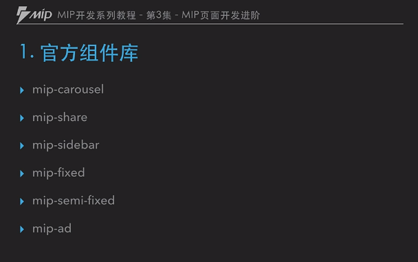
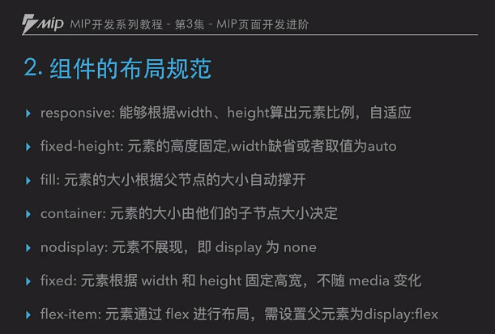

# 3.MIP页面开发进阶

视频地址：https://bit.baidu.com/course/detail/id/189/column/120.html

1. 官方组件库
2. 组件布局规范
3. 如何使用组件

## 1.官方组件库

### 1.1 内置组件

内置组件是包含在 mip.js 中的组件，可直接使用，无需另外引入js脚本。

### 1.2 个性话组件

个性化组件是满足于特定需求的组件，包括交互，统计等需求。需要引入对应的 js 脚本。

### 1.3 广告组件

广告组件主要满足各类广告的投放，需要引入对应的 js 脚本。阅读广告文档来确定 MIP 广告类型.

## 2.组件的布局规范
文档： https://www.mipengine.org/doc/3-widget/11-widget-layout.html  

## 3.如何使用部件

### 1.直接复制官方的组件使用

### 1.1 更具官方的组件去改造
拿官方的第一组件，给每个图片上加上描述性的文字

