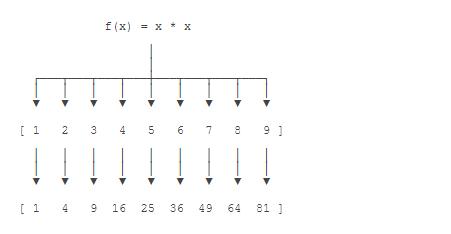

# 20. map/reduce

Python 内建了 map() 和 reduce() 函数。

如果你读过 google 的那篇大名鼎鼎的论文 "[MapReduce: Simplified Data Processing on Large Clusters](http://research.google.com/archive/mapreduce.html)"
，你就能大概明白map/reduce的概念。

## map

我们先看 map 。map() 函数接收两个参数，一个是函数，一个是 Iterable，map 将传入的函数依次作用到序列的每个元素，并把结果作为新的 Iterator 实现如下：



现在，我们用 Python 代码实现：

````python
>>> def f(x):
...     return x * x
...
>>> r = map(f, [1, 2, 3, 4, 5, 6, 7, 8, 9])
>>> list(r)
[1, 4, 9, 16, 25, 36, 49, 64, 81]
````

map() 传入的第一个参数是 f ，即函数对象本身。由于结果 r 是一个 Iterator，Iterator 是惰性序列，因此通过 list() 函数让它把整个序列都计算出来并返回一个 list。

你可能会想，不需要 map() 函数，写一个循环，也可以计算出结果：

````python
L = []
for n in [1, 2, 3, 4, 5, 6, 7, 8, 9]:
    L.append(f(n))
print(L)
````

的确可以，但是，从上面的循环代码，能一眼看明白 "把f(x)作用在 list 的每一个元素并把结果生成一个新的list" 吗？

 所以，map() 作为高阶函数，事实上它把运算规则抽象了，因此，我们不但可以计算简单的 f(x)= x*x，还可以计算任意复杂的函数，比如，把这个list 所有数字转为字符串：

 ````python
 >>> list(map(str, [1, 2, 3, 4, 5, 6, 7, 8, 9]))
['1', '2', '3', '4', '5', '6', '7', '8', '9']
 ````

 只需要一行代码。

## reduct 用法

reduct 把函数作用在一个序列 [x1, x2, x3, ...] 上，这个函数必须接收两个参数，reduce 把结果继续和序列的下一个元素做累积计算，其效果就是：

````python
reduce(f, [x1, x2, x3, x4]) = f(f(f(x1, x2), x3), x4)
````

比方说对一个序列求和，就可以用 reduct 实现：

````python
>>> from functools import reduce
>>> def add(x, y):
...     return x + y
...
>>> reduce(add, [1, 3, 5, 7, 9])
25
````

当然求和运算可以直接用 Python 内建函数 sum() ,没必要动用 reduce。

但是如果把序列 [1, 3, 5, 7, 9] 变成整数 13579，reduce 就可以派上用场：

````python
>>> from functools import reduce
>>> def fn(x, y):
...     return x * 10 + y
...
>>> reduce(fn, [1, 3, 5, 7, 9])
13579
````

这个例子本身没多大用处，但是，如果考虑到字符串 str 也是一个序列，对上面的例子稍加改动，配合 map(),我们就可以实现 str 转换为 int 的函数:

````python
>>> from functools import reduce
>>> def fn(x, y):
...     return x * 10 + y
...
>>> def char2num(s):
...     digits = {'0': 0, '1': 1, '2': 2, '3': 3, '4': 4, '5': 5, '6': 6, '7': 7, '8': 8, '9': 9}
...     return digits[s]
...
>>> reduce(fn, map(char2num, '13579'))
13579
````

整理成一个 str2int 的函数就是：

````python
from functools import reduce

DIGITS = {'0': 0, '1': 1, '2': 2, '3': 3, '4': 4, '5': 5, '6': 6, '7': 7, '8': 8, '9': 9}

def str2int(s):
    def fn(x, y):
        return x * 10 + y
    def char2num(s):
        return DIGITS[s]
    return reduce(fn, map(char2num, s))
````

还可以用lambda函数进一步简化成：

````python
from functools import reduce

DIGITS = {'0': 0, '1': 1, '2': 2, '3': 3, '4': 4, '5': 5, '6': 6, '7': 7, '8': 8, '9': 9}

def char2num(s):
    return DIGITS[s]

def str2int(s):
    return reduce(lambda x, y: x * 10 + y, map(char2num, s))
````

也就是说，假设Python没有提供 int() 函数，完全可以自己写一个字符串转化为整数的函数，而且只需要几行代码！

lambda 函数的用法在后面介绍。

[【原文地址】](https://www.liaoxuefeng.com/wiki/0014316089557264a6b348958f449949df42a6d3a2e542c000/0014317852443934a86aa5bb5ea47fbbd5f35282b331335000#0) [【参考源码】](https://github.com/michaelliao/learn-python3/tree/master/samples/functional)

