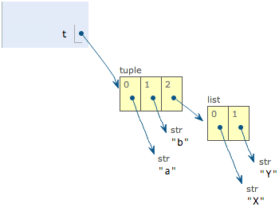

# 3.使用 list 和 tuple

## 3.1 list

Python 内置的一种数据类型是列表：list。list 是一种有序的集合，可以随时添加和删除其中的元素。  

比如，列出班里所有同学的名字，就可以用一个list 表示：  

````python
>>> classmates = ['Michael', 'Bob', 'Tracy']
>>> classmates
['Michael', 'Bob', 'Tracy']
````

变量**classmates** 就是一个list，用 **len()** 函数就可以获得 list 元素的个数：

````python
>>> len(classmates)
3
````

用索引来访问 list 中的每一个位置元素，记得索引是从 0 开始的：
````python
>>> classmates[0]
'Michael'
>>> classmates[1]
'Bob'
>>> classmates[2]
'Tracy'
>>> classmates[3]
Traceback (most recent call last):
  File "<stdin>", line 1, in <module>
IndexError: list index out of range
````

当索引超出了范围时，Python 会报一个 IndexError 错误，所以，要确保索引不要越界，记得最后一个元素的索引是 len(classmates) - 1
````python
>>> classmates[-1]
'Tracy'
````

以此类推，可以获取倒数第 2 个，倒数第 3 个：

````python
>>> classmates[-2]
'Bob'
>>> classmates[-3]
'Michael'
>>> classmates[-4]
Traceback (most recent call last):
  File "<stdin>", line 1, in <module>
IndexError: list index out of range
````

当然，倒数第 4 个，就越界了。

list 是一个可变的有序表，所以，可以往 list 中追加元素到末尾：

````python
>>> classmates.append('Adam')
>>> classmates
['Michael', 'Bob', 'Tracy', 'Adam']
````

也可以把元素插入到指定的位置，比如索引为 1 的位置：

````python
>>> classmates.insert(1, 'Jack')
>>> classmates
['Michael', 'Jack', 'Bob', 'Tracy', 'Adam']
````

要删除 list 末尾的元素，用 pop() 方法：  
````python
>>> classmates.pop()
'Adam'
>>> classmates
['Michael', 'Jack', 'Bob', 'Tracy']
````

要删除指定位置的元素，用 pop(i) 方法，其中 i 是索引的位置：

````python
>>> classmates.pop(1)
'Jack'
>>> classmates
['Michael', 'Bob', 'Tracy']
````

要是把某个元素替换成别的元素，可以直接把赋值给对应的索引位置：

````python
>>> classmates[1] = 'Sarah'
>>> classmates
['Michael', 'Sarah', 'Tracy']
````


list 里面的元素的数据类型也可以不同，比如：  
````python
>>> L = ['Apple', 123, True]
````

list 元素也可以是另一个list，比如：  

````python
>>> s = ['python', 'java', ['asp', 'php'], 'scheme']
>>> len(s)
4
````

要注意 s 只有 4 个元素，其中 s[2] 又是一个 list，如果拆开写就更容易理解了：

````python
>>> p = ['asp', 'php']
>>> s = ['python', 'java', p, 'scheme']
````

要拿到'php'可以写p[1]或者s[2][1]，因此s可以看成是一个二维数组，类似的还有三维、四维……数组，不过很少用到。

如果一个 list 中一个元素也没有，就是一个空的 list ,它长度为 0：

````python
>>> L = []
>>> len(L)
0
````

总结：list 数据类型相当于 PHP 的数组，list 中的数据类型没有限制

list 常用操作：

|函数                    |作用        |
|------------------------|-----------|
|list.append('qucheng')  |添加元素    |
|list.insert(1,'qucheng')|插入指定位置|
|list.pop()              |删除最后参数|
|list.pop(i)             |删除指定位置的元素|
|list.sort()             |排序|
## 3.2. tuple

另一种有序的列表叫 **元组**：tuple。tuple 和 list 非常类似，但是 tuple 一旦初始化就不能修改，比如同样是列出同学的名字： 

````python
>>> classmates = ('Michael', 'Bob', 'Tracy')
````
现在这个 classmates 这个 tuple 不能变了，它也没有 append()，insert() 这样的方法。其他获取元素的方法和 list 是一样的，可以正常的使用 classmates[0]，classmates[-1]，但不能赋值成另外的元素。  

不可变的tuple有什么意义？因为tuple不可变，所以代码更安全。如果可能，能用 tuple 代替 list 就尽量用 tuple。

tuple 的陷阱，当你定义一个 tuple 的时候，tuple 的元素就必须要被确定下来，比如：  

````python
>>> t = (1, 2)
>>> t
(1, 2)
````

如果定义一个空 tuple,可以写成：  
````python
>>> t = ()
>>> t
()
````

但是，要定义一个只有一个元素的 tuple ，如果你这么定义：  

````python
>>> t = (1)
>>> t
1
````

定义的不是 tuple ，是 1 这个数! 这是因为括号 既可以表示 tuple，又可以表示数学公式中的小括号，这就产生了歧义，因此，Python规定，这种情况下，按小括号进行计算，计算结果自然是 1 。

所以，只有 1 个元素的 tuple 定义时必须加个逗号，来消除歧义：
````python
>>> t = (1,)
>>> t
(1,)
````

Python 在显示只有 1 个元素的 tuple 时，也会加一个(,)逗号，以免误解成数学计算意义上括号。

最后来看一个"可变"的 tuple:

````python
>>> t = ('a', 'b', ['A', 'B'])
>>> t[2][0] = 'X'
>>> t[2][1] = 'Y'
>>> t
('a', 'b', ['X', 'Y'])
````
这个tuple定义的时候有3个元素，分别是'a'，'b'和一个list。不是说tuple一旦定义后就不可变了吗？怎么后来又变了？

别急，我们先看看定义的时候tuple包含的3个元素：


当我们把list的元素'A'和'B'修改为'X'和'Y'后，tuple变为：



表面上看，tuple的元素确实变了，但其实变的不是tuple的元素，而是list的元素。tuple一开始指向的list并没有改成别的list，所以，tuple所谓的“不变”是说，tuple的每个元素，指向永远不变。即指向'a'，就不能改成指向'b'，指向一个list，就不能改成指向其他对象，但指向的这个list本身是可变的！

理解了“指向不变”后，要创建一个内容也不变的tuple怎么做？那就必须保证tuple的每一个元素本身也不能变。

## 练习

````python
# -*- coding: utf-8 -*-

L = [
    ['Apple', 'Google', 'Microsoft'],
    ['Java', 'Python', 'Ruby', 'PHP'],
    ['Adam', 'Bart', 'Lisa']
]
````

````python
# 打印Apple:
print(?)
# 打印Python:
print(?)
# 打印Lisa:
print(?)
````


总结：list和tuple是Python内置的有序集合，一个可变，一个不可变。根据需要来选择使用它们。
