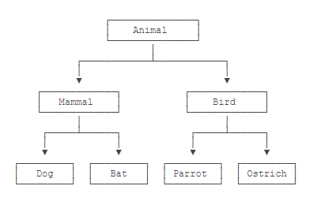
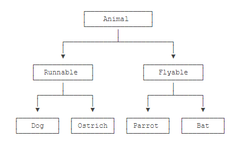
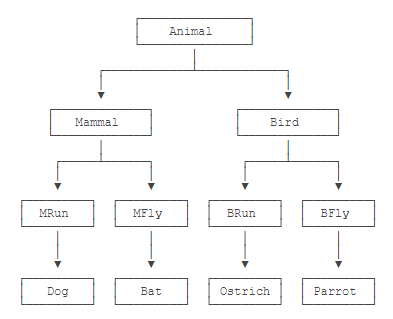

# 39.多重继承

继承是面向对象变成的一个重要的方式，因为通过继承，子类就可以扩展父类的功能。

回忆一下 Adimal 类层次的设计，假设我们要实现一下 4 中动物：

* Dog - 狗狗；
* Bat - 蝙蝠；
* Parrot - 鹦鹉；
* Ostrich - 鸵鸟。

如果按照哺乳动物和鸟类归类，我们可以设计出这样的层次：



但是如果按照“能跑”和“能飞”来归类，我们就应该设计出这样的类的层次：



如果要把上面的两种分类都包含进来，我们就得设计更多的层次：

* 哺乳类：能跑的哺乳类，能飞的哺乳类；
* 鸟类：能跑的鸟类，能飞的鸟类。


这么一来，类的层次就复杂了：



如果要再增加 "宠物类" 和 "非宠物类" ，这么高下去，类的数量会呈指数增长，很明显这样设计师不行的。

正确的做法是采用多重继承。首先，主要的类层次仍按照哺乳类和鸟类设计：
````python
class Animal(object):
    pass

# 大类:
class Mammal(Animal):
    pass

class Bird(Animal):
    pass

# 各种动物:
class Dog(Mammal):
    pass

class Bat(Mammal):
    pass

class Parrot(Bird):
    pass

class Ostrich(Bird):
    pass
````

现在我们给动物在加上 Runnable 和 Flyable 的功能，只需要先定义好 Runnable 和 Flyable 的类：
````python
class Runnable(object):
    def run(self):
        print('Running...')

class Flyable(object):
    def fly(self):
        print('Flying...')
````

对于需要 Runnable 功能的动物，就多继承一个 Runable ，例如 Dog:
````python
class Dog(Mammal, Runnable):
    pass
````

对于需要 Flyable 功能的动物，就多继承一个 Flyable，例如：
````python
class Bat(Mammal, Flyable):
    pass
````

通过多重继承，一个子类可以同时获得多个父类的所有功能。

## Mixln

在设计类的继承的关系时，通常，主线都是单一继承下来的，例如， Ostrich 继承自 Bird。但是，如果需要"混入" 额外的功能，通过多继承就可以实现，比如，让 Ostrich 除了继承自 Bird 外，再同时继承Runnable。这种设计通常称之为 Mixln。

为了更好地看出继承关系，我们把 Runnable 和 Flyable 改为 RunnablemixIn 和 FlyableMixIn ，让某个动物同时拥有好几个 MixIn:

````python
class Dog(Mammal, RunnableMixIn, CarnivorousMixIn):
    pass
````

MixIn 的目的就是给一个类增加多个功能，这样，在设计类的时候，我们优先考虑通过多重继承来组合多个 MixIn 的功能，而不是设计多层次复杂的继承关系。

Python 自带的很多库也使用了MinIx。举个例子，Python 自带了 TCPServer 和 UDPServer 这两类网络服务，而要同时服务多个用户就必须使用多进程或多线程模型，这两种模型由 ForkingMixIn 和 ThreadingMixIn 提供。通过组合，我们就可以创造出合适的服务来。

比如，编写一个多进程模式的 TCP 服务，定义如下：
````python
class MyTCPServer(TCPServer, ForkingMixIn):
    pass
````

编写一个多线程模式的 UDP 服务，定义如下：
````python
class MyUDPServer(UDPServer, ThreadingMixIn):
    pass
````

如果你打算搞一个更先进的协程模型，就可以编写一个 CoroutineMixIn：
````python
class MyTCPServer(TCPServer, CoroutineMixIn):
    pass
````

这样一来，我们不需要复杂而庞大的继承链，只要选择组合不同的类的功能，就可以快速构造出所需的子类。

总结：

由于Python 允许使用多重继承，因此，MixIn就是一种常见的设计。

只允许单一继承的语言，(如 java) 不能使用 MixIn 的设计。

[【原文地址】](https://www.liaoxuefeng.com/wiki/0014316089557264a6b348958f449949df42a6d3a2e542c000/0014318680104044a55f4a9dbf8452caf71e8dc68b75a18000)
