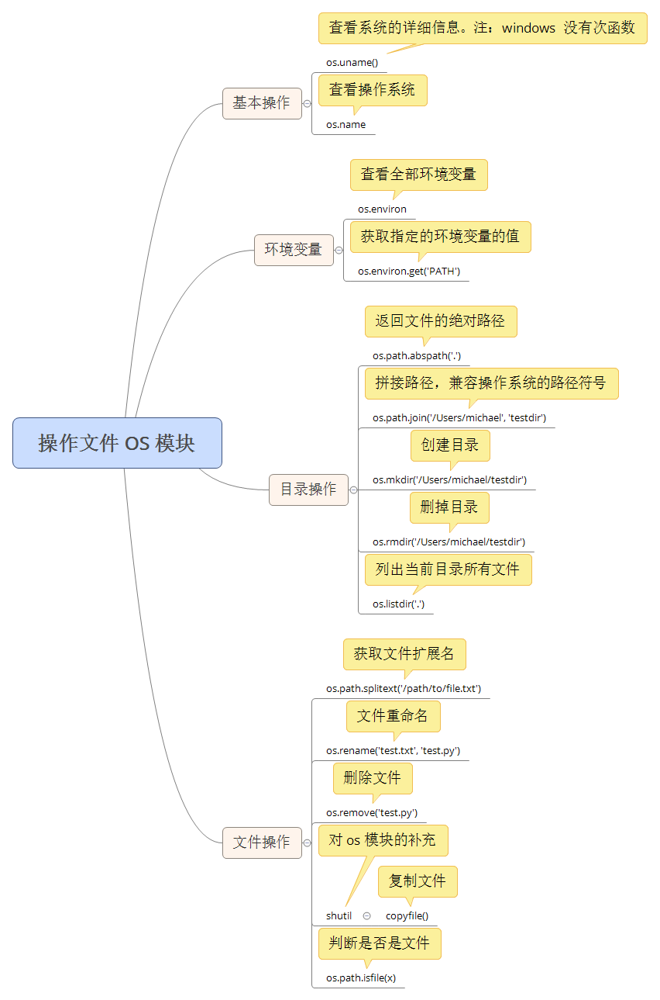

# 51.操作文件和目录

如果我们要操作文件、目录，可以在命令行下面输入操作系统提供的各种命令来完成。比如 dir、cp 等命令。

如果要再 Python程序中执行这些目录和文件操作怎么办？其实操作系统提供命令只是简单地调用了接口函数，Python内置的 os 模块也可以直接调用操作系统提供的函数。

打开 Python 交互命令行，我们来看看如果使用 os 模块的基本功能：
````python
>>> import os
>>> os.name # 操作系统类型
'posix'
````

如果是 posix ，说明操作系统是 Linux、Unix 或 Mac OS X，如果是 nt，就是 windows 操作系统。要或取详细的系统信息，可以调用 uname() 函数：

````python
>>> os.uname()
posix.uname_result(sysname='Darwin', nodename='MichaelMacPro.local', release='14.3.0', version='Darwin Kernel Version 14.3.0: Mon Mar 23 11:59:05 PDT 2015; root:xnu-2782.20.48~5/RELEASE_X86_64', machine='x86_64')
````

注意 uname() 函数在 windows 上不提供，也就是说，os 模块的某些函数是跟操作系统相关的。


## 环境变量

在操作系统中定义的环境变量，全部保存在 os.environ 这个变量中，可以直接查看：
````python
>>> os.environ
environ({'VERSIONER_PYTHON_PREFER_32_BIT': 'no', 'TERM_PROGRAM_VERSION': '326', 'LOGNAME': 'michael', 'USER': 'michael', 'PATH': '/usr/bin:/bin:/usr/sbin:/sbin:/usr/local/bin:/opt/X11/bin:/usr/local/mysql/bin', ...})
````

要获取某个环境变量的值，可以直接调用 os.environ.get('key')：

````python
>>> os.environ.get('PATH')
'/usr/bin:/bin:/usr/sbin:/sbin:/usr/local/bin:/opt/X11/bin:/usr/local/mysql/bin'
>>> os.environ.get('x', 'default')
'default'
````

## 操作文件和目录

操作文件和目录函数一部分放在 os 模块中，一部分放在 os.path 模块中，这一点要注意一下，查看、创建和删除目录可以这么调用：

````python
# 查看当前目录的绝对路径:
>>> os.path.abspath('.')
'/Users/michael'
# 在某个目录下创建一个新目录，首先把新目录的完整路径表示出来:
>>> os.path.join('/Users/michael', 'testdir')
'/Users/michael/testdir'
# 然后创建一个目录:
>>> os.mkdir('/Users/michael/testdir')
# 删掉一个目录:
>>> os.rmdir('/Users/michael/testdir')
````

把两个路径合成一个时，不要直接拼字符串，而通过 os.path.join() 函数，这样可以正确处理不同操作系统的路径分隔符。在 Linux/Unix/Mac 下，os.path.join() 返回这样的字符串：

````python
part-1/part-2
````

而windows 下会返回这样的字符串：

````python
part-1\part-2
````

同样的道理，要拆分路径时，也不要直接去拆字符串，而要通过 os.paht.split() 函数 这样可以把一个路径分为两部分，后一部分总是最后级别的目录或文件名：

````python
>>> os.path.split('/Users/michael/testdir/file.txt')
('/Users/michael/testdir', 'file.txt')
````

os.path.splitext() 可以直接让你得到文件扩展名，很多时候非常方便：

````python
>>> os.path.splitext('/path/to/file.txt')
('/path/to/file', '.txt')
````

这些合并、拆分路径的函数并不要求目录和文件要真实存在，它们只对字符串进行操作。

文件操作使用下面的函数。假定当前目录下有一个 test.txt 文件：
````python
# 对文件重命名:
>>> os.rename('test.txt', 'test.py')
# 删掉文件:
>>> os.remove('test.py')
````

但是复制文件的函数居然在 os 模块中不存在！原因是复制文件并非由操作系统提供的系统调用。理论上讲，我们通过上一节读写文件可以完成文件复制，只不过要多写很多代码。

幸运的是 shutil 模块提供了 copyfile() 的函数，你可以在 shutil 模块中找到很多实用的函数，它们可以看做是 os 模块的补充。

最后看看如果利用 Python 的特性来过滤文件。比如我们要列出当前目录下的所有目录，只需要一行代码：
````python
>>> [x for x in os.listdir('.') if os.path.isdir(x)]
['.lein', '.local', '.m2', '.npm', '.ssh', '.Trash', '.vim', 'Applications', 'Desktop', ...]
````

要列出所有的 .py 文件，也只需要一行代码：

````python
>>> [x for x in os.listdir('.') if os.path.isfile(x) and os.path.splitext(x)[1]=='.py']
['apis.py', 'config.py', 'models.py', 'pymonitor.py', 'test_db.py', 'urls.py', 'wsgiapp.py']
````

是不是非常简洁？

总结：

python 的 os 模块封装了操作系统的目录和文件操作，要注意这些函数有的在 os 的模块中，有的在 os.paht 模块中。


练习：

1.利用os模块编写一个能实现dir -l输出的程序。

2.编写一个程序，能在当前目录以及当前目录的所有子目录下查找文件名包含指定字符串的文件，并打印出相对路径。

参考源码：[do_dir](https://github.com/michaelliao/learn-python3/blob/master/samples/io/do_dir.py)


目录操作函数：

|函数|作用|
|----|---|
|基本函数|
|os.uname()|查看系统的详细信息。注：windows  没有次函数|
|os.name|查看操作系统|
|环境变量|
|os.environ|查看全部环境变量|
|os.environ.get('PATH')|获取指定的变量|
|目录操作|
|os.path.abspath('.')|返回文件的绝对路径|
|os.mkdir('/Users/michael/testdir')|创建文件夹|
|os.rmdir('/Users/michael/testdir')|删除文件夹|
|os.listdir('.')|列出当前目录所有文件|
|文件操作|
|os.path.splitext('/path/to/file.txt')|获取文件扩展名|
|os.rename('test.txt', 'test.py')|文件重命名|
|os.remove('test.py')|删除文件|
|shutil copyfile()|用shutil模块的 copyfile() 函数复制文件|
|os.path.isfile(x)|判断否是文件|


函数图片：


