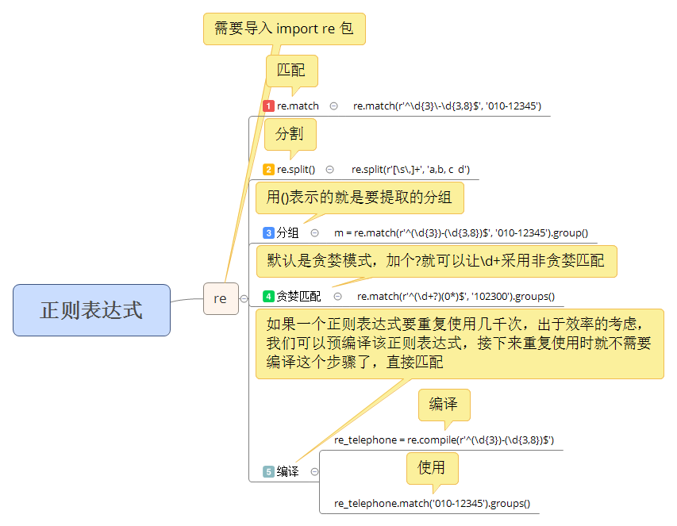

# 59.正则表达式

字符串是编程设计到最多的一种数据结结构，对字符串操作的需求几乎无处不在。比如判断一个字符串是否是合法的 Email 地址，虽然可以编程提取 @ 前后的子串，在分别判断是否是单词和域名，但这样不但麻烦，而且代码难以复用。

正则表达式是用来匹配字符串强有力的武器。它的设计思想是用一种描述性的语言来给字符串一个规则，凡是符合规则的字符串，我们就认为它 '匹配' 了，否则，该字符串就是不合法的。

所以我们判断一个字符串是否是合法的 email 的方法是：

1. 创建一个匹配的Email 的正则表达式
2. 用该正则表达式判断用户输入的是否合法

因为正则表达式也是用字符表示的，所以，我们首先了解如何用字符来描述字符串。

在正则表达式中，如果直接给出字符，就是精确匹配，。用 \d 可以匹配一个数字，用 \w 可以匹配以字母或数字，所以：

* '00\d' 可以匹配 '007'，但无法匹配 '00A';
* '\d\d\d' 可以匹配 '010'
* '\w\w\d' 可以匹配 'py3'

. 可以匹配任意字符，所以：

* 'py.' 可以匹配 'pyc'，'pyo'、'py!' 等等

要匹配变长的字符，在正则表达式中，用 * 表示任意个字符 (包括 0 个)，用 + 表示至少一个字符，用 ? 表示 0 个或 1 个字符，用 {n} 表示 n 个字符，用 {n,m} 表示 n-m 个字符：

来看一个复杂的例子： \d{3}\s+\d{3,8}

我们从左到又解读一下：

1. \d{3} 表示匹配3个数字，例如 '010'
2. \s 可以匹配一个空格 (也包括Tab 等空白符)，所以 \s+ 表示至少有一个空格，例如匹配 ' ',' '等
3. \d{3,8} 表示 3-8 个数字，例如 '1234567'

综合起来，上面的正则表达式可以匹配以任意空格隔开的带区号的电话号码。

如果要匹配 '010-123456' 这样的号码呢？由于 '-' 是特殊字符，在正则表达式中，要用 '\' 转义，所以，上面的正则式 \d{3}\-\d{3,8}

但是，仍然无法匹配 '010 - 123456'，因为带有空格。所以我们需要更复杂的匹配方式。

## 进阶

要做更精确得匹配，可以用 [] 表示范围，比如：

* [0-9a-zA-Z\_] 可以匹配一个数字、字母或者下划线
* [0-9a-zA-Z\_]+ 可以匹配至少由一个数字、字母或者下划线组成的字符串，比如 'a100'，'0_z'，'Py3000' 等等。
* [a-zA-Z\_][0-9a-zA-Z\_]* 可以匹配由字母或下划线开头，后接任意一个数字、字母或者下划线组成的字符串，也就是Python 的合法变量。
* [a-zA-Z\_][0-9a-zA-Z\_]{0,19} 更精确地限制了变量的长度是 1-20 个字符 (前面1个字符+后面最多19个字符) 。

A|B 可以匹配 A 或 B，所以(P|p)ython 可以匹配 'Python' 和 'python'。

^ 表示行开头，^\d 表示必须是数字开头。

$ 表示行的结束，\d$ 表示必须是数字结束

你可能注意到了，py 也可以匹配 'python' ，但是加上 ^py& 就变成了整行匹配，就只能匹配 'py' 了。

## re 模块

有了准备知识，我们就可以在 Python 中使用正则表达了。Python 提供了 re 模块，包含所有正则表达式的能力。由于 Python 的字符串本身也用 \ 转义，所以要特别注意：

````python
s = 'ABC\\-001' # Python的字符串
# 对应的正则表达式字符串变成：
# 'ABC\-001'
````

因此我们强烈建议使用 Python 的 r 前缀，就不用考虑专一的问题了：

````python
>>> import re
>>> re.match(r'^\d{3}\-\d{3,8}$', '010-12345')
<_sre.SRE_Match object; span=(0, 9), match='010-12345'>
>>> re.match(r'^\d{3}\-\d{3,8}$', '010 12345')
>>>
````

先看看如何判断正则表达式是否匹配：

````python
>>> import re
>>> re.match(r'^\d{3}\-\d{3,8}$', '010-12345')
<_sre.SRE_Match object; span=(0, 9), match='010-12345'>
>>> re.match(r'^\d{3}\-\d{3,8}$', '010 12345')
>>>
````

match() 方法判断是否匹配，如果匹配成功，返回一个Match对象，否则返回一个 None。常见的判断方法就是：
````python
test = '用户输入的字符串'
if re.match(r'正则表达式', test):
    print('ok')
else:
    print('failed')
````

## 切分字符串

用正则表达式切分字符串比用固定的字符串更灵活，请看正常的切分代码：

````python
>>> 'a b   c'.split(' ')
['a', 'b', '', '', 'c']
````
恩，无法识别连续的空格，用正则表达式试试：
````python
>>> re.split(r'\s+', 'a b   c')
['a', 'b', 'c']
````

无论多少个空格都可以正常分割。加入 , 试试：

````python
>>> re.split(r'[\s\,]+', 'a,b, c  d')
['a', 'b', 'c', 'd']
````

除了简单判断是否匹配之外，正则表达式还有提取子串的强大功能。用 () 表示的就是要提取的分组 (Group)。比如：

^(\d{3}-(\d{3-8}))$ ，分别定义了两个组，可以直接从匹配的字符串中提取区号和本地号码：

````python
>>> m = re.match(r'^(\d{3})-(\d{3,8})$', '010-12345')
>>> m
<_sre.SRE_Match object; span=(0, 9), match='010-12345'>
>>> m.group(0)
'010-12345'
>>> m.group(1)
'010'
>>> m.group(2)
'12345'
````
如果正则表达式定义了组，就可以在 Match 对象上用 group() 方法提取子串来。

注意到 group(0) 永远是原始字符串，，group(1)、group(2) …… 表示第1、2、……个子串。 

提取字符非常有用，来看一个更凶残的例子：
````python
>>> t = '19:05:30'
>>> m = re.match(r'^(0[0-9]|1[0-9]|2[0-3]|[0-9])\:(0[0-9]|1[0-9]|2[0-9]|3[0-9]|4[0-9]|5[0-9]|[0-9])\:(0[0-9]|1[0-9]|2[0-9]|3[0-9]|4[0-9]|5[0-9]|[0-9])$', t)
>>> m.groups()
('19', '05', '30')
````

这个正则表达式可以直接识别合法的时间。但是有些时候，用正则表达式也会无法做到完全验证，比如识别时间：
````python
'^(0[1-9]|1[0-2]|[0-9])-(0[1-9]|1[0-9]|2[0-9]|3[0-1]|[0-9])$'
````

对于'2-30'，'4-31'这样的非法日期，用正则还是识别不了，或者说写出来非常困难，这时就需要程序配合识别了。

## 贪婪匹配
最后需要特别指出的是，正则匹配默认是贪婪匹配，也就是匹配尽可能多的字符。举例如下，匹配出数字后面的0：

````python
>>> re.match(r'^(\d+)(0*)$', '102300').groups()
('102300', '')
````

由于\d+采用贪婪匹配，直接把后面的0全部匹配了，结果0*只能匹配空字符串了。

必须让\d+采用非贪婪匹配（也就是尽可能少匹配），才能把后面的0匹配出来，加个?就可以让\d+采用非贪婪匹配：

````python
>>> re.match(r'^(\d+?)(0*)$', '102300').groups()
('1023', '00')
````

## 编译

当我们在Python中使用正则表达式时，re模块内部会干两件事情：

1. 编译正则表达式，如果正则表达式的字符串本身不合法，会报错；
2. 用编译后的正则表达式去匹配字符串。

如果一个正则表达式要重复使用几千次，出于效率的考虑，我们可以预编译该正则表达式，接下来重复使用时就不需要编译这个步骤了，直接匹配：

````python
>>> import re
# 编译:
>>> re_telephone = re.compile(r'^(\d{3})-(\d{3,8})$')
# 使用：
>>> re_telephone.match('010-12345').groups()
('010', '12345')
>>> re_telephone.match('010-8086').groups()
('010', '8086')
````
编译后生成Regular Expression对象，由于该对象自己包含了正则表达式，所以调用对应的方法时不用给出正则字符串。


总结：

正则表达式非常强大，要在短短的一节里讲完是不可能的。要讲清楚正则的所有内容，可以写一本厚厚的书了。如果你经常遇到正则表达式的问题，你可能需要一本正则表达式的参考书。


正则表达式字符：

|字符|作用|
|----|----|
|\d|0-9数字|
|\w|字母或数字|
|.|任意字符| 
|\s|空格|

思维导图：




https://www.liaoxuefeng.com/wiki/0014316089557264a6b348958f449949df42a6d3a2e542c000/00143193331387014ccd1040c814dee8b2164bb4f064cff000
