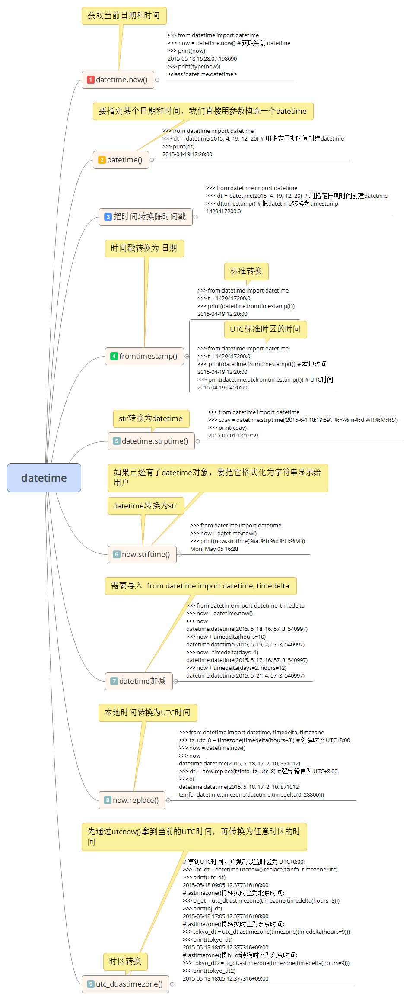

# 61.datetime

datatime 是 Python 处理日期和时间的标准库。

## 获取当前日期和时间

我们先看如何获取当前日期和时间：
````python
>>> from datetime import datetime
>>> now = datetime.now() # 获取当前datetime
>>> print(now)
2015-05-18 16:28:07.198690
>>> print(type(now))
<class 'datetime.datetime'>
````

注意到 datetime 是模块，datetime 模块还包含一个 datetime 类，通过 from datetime import datetime 导入才是 datetime 这个类。

如果仅导入 import datetiime ，则必须引入全名 datetime.datetime。

datetime.now() 返回当前日期和时间，其类型是 datetime。

## 获取指定日期和时间

要指定某个日期和时间，我们直接用参数构造一个 datetime：

````python
>>> from datetime import datetime
>>> dt = datetime(2015, 4, 19, 12, 20) # 用指定日期时间创建datetime
>>> print(dt)
2015-04-19 12:20:00
````

### datetime 转换为 timestamp(时间戳)

在计算机中，时间实际上是用数字表示的。我们把 1970 年 1 月 1 日 00:00:00 UTC+00:00 时区的时刻称为 epoch time (新纪元时间) 记为0（1970年以前的时间timestamp为负数），当前时间就是相对于epoch time的秒数，称为timestamp。

可以认为：
````
timestamp = 0 = 1970-1-1 00:00:00 UTC+0:00
````
对应的北京时间是：
````
timestamp = 0 = 1970-1-1 08:00:00 UTC+8:00
````

可见 timestamp 的值与是去毫无关系，因为 timestamp 一旦确定，其 UTC 时间就确定了，转换到任意时区的时间也是完全确定的，这就是为什么计算机存储的当前时间是以 timestamp 表示的，因为全球各的计算机在任意时刻的 timestamp 都是完全相同的 (假定一时间已校准)

把一个 datetime 类型转换为 timestamp 只需要简单调用 timestamp() 方法：
````python
>>> from datetime import datetime
>>> dt = datetime(2015, 4, 19, 12, 20) # 用指定日期时间创建datetime
>>> dt.timestamp() # 把datetime转换为timestamp
1429417200.0
````

注意 Python 的 timestamp 是一个浮点数。如果有小数位，小数位表示毫秒数。

某些编程语言 (如 Java 和 JavaScript) 的 timestamp 表示毫秒数，这种情况只需把 timestamp 除以 1000 就得到 Python 的浮点表示方法。

### timestamp 转换位 datetime

要把 timestamp 转换为 datetime，使用 datetime 提供的 fromtimestamp() 方法：

````python
>>> from datetime import datetime
>>> t = 1429417200.0
>>> print(datetime.fromtimestamp(t))
2015-04-19 12:20:00
````

注意到 timestamp 是一个浮点数，它没有时区的概念，而 datetime 是有时区的。上述转换是 timestamp 和本地时间做转换。

本地时间是指当前操作系统设定的时区。例如北京时间是东 8 区，则本地时间：

````
2015-04-19 12:20:00
````

实际上就是UTC+8:00时区的时间：

````
2015-04-19 12:20:00 UTC+8:00
```` 

而此刻的格林威治标准时间与北京时间差了8小时，也就是UTC+0:00时区的时间应该是：

````
2015-04-19 04:20:00 UTC+0:00
````

timestamp也可以直接被转换到UTC标准时区的时间：

````python
>>> from datetime import datetime
>>> t = 1429417200.0
>>> print(datetime.fromtimestamp(t)) # 本地时间
2015-04-19 12:20:00
>>> print(datetime.utcfromtimestamp(t)) # UTC时间
2015-04-19 04:20:00
````

### str 转 datetime

很多时候，用户输入的日期和时间都是字符串，要处理日期和时间，首先把 str 转换为 datetime。转换方法是通过一个日期和时间格式化字符串：
````python
>>> from datetime import datetime
>>> cday = datetime.strptime('2015-6-1 18:19:59', '%Y-%m-%d %H:%M:%S')
>>> print(cday)
2015-06-01 18:19:59
````

字符串 '%Y-%m-%d %H:%M:%S' 规定了日期和时间部分的格式。详细的说明请参考 [Python文档](https://docs.python.org/3/library/datetime.html#strftime-strptime-behavior)

注意转换后的datetime 是没有时区信息的。

### datetime 转换为 str

如果已经有了 datetime 对象，要把他格式化字符串显示给用户，就需要转换为 str，转换方式通过 strftime() 实现的，同样需要一个日期和时间的格式化字符串：

````python
>>> from datetime import datetime
>>> now = datetime.now()
>>> print(now.strftime('%a, %b %d %H:%M'))
Mon, May 05 16:28
````

### datetime加减

对日期和时间进行加减实际上就是把 datetime 往后或者往前计算，得到新的 datetime。加减可以直接用 + 和 - 运算符，不过需要导入 timedelta 这个类：

````python
>>> from datetime import datetime, timedelta
>>> now = datetime.now()
>>> now
datetime.datetime(2015, 5, 18, 16, 57, 3, 540997)
>>> now + timedelta(hours=10)
datetime.datetime(2015, 5, 19, 2, 57, 3, 540997)
>>> now - timedelta(days=1)
datetime.datetime(2015, 5, 17, 16, 57, 3, 540997)
>>> now + timedelta(days=2, hours=12)
datetime.datetime(2015, 5, 21, 4, 57, 3, 540997)
````

可见 使用 timedelta 可以很容易地算出前几天和后几天的时刻。


## 本地时间转换为UTC时间

本地时间是指系统设定时区的时间，例如北京时间是 UTC+8:00时区的时间，而 UTC 时间指 UTC+0:00 时区的时间。

一个 datetime 类型是一个时区属性， tzinfo ，但是默认为 None，所以无法区别这个 datetime 到底是哪个时区，除非强行给 datetime 设置一个时区：

````python
>>> from datetime import datetime, timedelta, timezone
>>> tz_utc_8 = timezone(timedelta(hours=8)) # 创建时区UTC+8:00
>>> now = datetime.now()
>>> now
datetime.datetime(2015, 5, 18, 17, 2, 10, 871012)
>>> dt = now.replace(tzinfo=tz_utc_8) # 强制设置为UTC+8:00
>>> dt
datetime.datetime(2015, 5, 18, 17, 2, 10, 871012, tzinfo=datetime.timezone(datetime.timedelta(0, 28800)))
````

如果系统时区恰好是UTC+8:00，那么上述代码就是正确的，否则，不能强制设置为UTC+8:00时区。

## 时区转换

我们可以先通过 utcnow() 拿到当前的 UTC 时间，再转换为任意时区的时间：

````pyhton
# 拿到UTC时间，并强制设置时区为UTC+0:00:
>>> utc_dt = datetime.utcnow().replace(tzinfo=timezone.utc)
>>> print(utc_dt)
2015-05-18 09:05:12.377316+00:00
# astimezone()将转换时区为北京时间:
>>> bj_dt = utc_dt.astimezone(timezone(timedelta(hours=8)))
>>> print(bj_dt)
2015-05-18 17:05:12.377316+08:00
# astimezone()将转换时区为东京时间:
>>> tokyo_dt = utc_dt.astimezone(timezone(timedelta(hours=9)))
>>> print(tokyo_dt)
2015-05-18 18:05:12.377316+09:00
# astimezone()将bj_dt转换时区为东京时间:
>>> tokyo_dt2 = bj_dt.astimezone(timezone(timedelta(hours=9)))
>>> print(tokyo_dt2)
2015-05-18 18:05:12.377316+09:00
````

时区转换的关键在于，拿到一个 datetime 时，要获知其正确的时区，然后强制设置时区，作为基准时间。

利用带时区的 datetime，通过 astimezone() 方法，可以转换到任意时区。

注：不是必须从UTC+0:00时区转换到其他时区，任何带时区的datetime都可以正确转换，例如上述bj_dt到tokyo_dt的转换。

总结：

datetime 表示的时间需要时区信息才能确定一个特定的时间，否则只能视为本地时间。

如果要存储 datetime，最佳方法是将其转换为 timestamp 在存储，因为timestamp的值与时区完全无关。


[【练习代码】](https://github.com/michaelliao/learn-python3/blob/master/samples/commonlib/use_datetime.py)


[【原文地址】](https://www.liaoxuefeng.com/wiki/0014316089557264a6b348958f449949df42a6d3a2e542c000/001431937554888869fb52b812243dda6103214cd61d0c2000)


思维导图：


