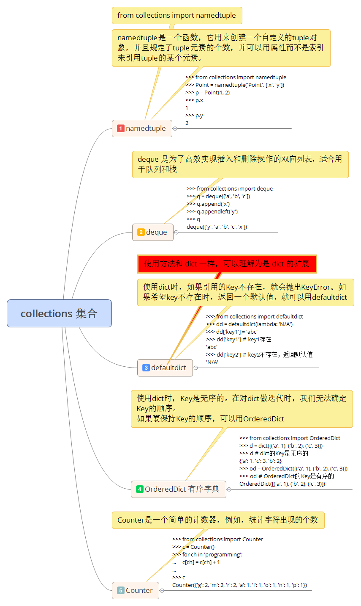

# 62.collections 集合

collecttions 是 Python 内建的一个集合模块，提供了许多有用的集合类。

## namedtuple 名元组
我们知道 tuple 可以表示不变集合，例如，一个点的二维坐标就可以表示成：
````python
>>> p = (1, 2)
````

但是，看到 (1,2)，很难看出这个 tuple 是用来表示一个坐标的。

定义一个 class 又小题大做了，这时，namedtuple 就派上用场：
````python
>>> from collections import namedtuple
>>> Point = namedtuple('Point', ['x', 'y'])
>>> p = Point(1, 2)
>>> p.x
1
>>> p.y
2
````

namedtuple 是一个函数，它用来创建一个自定义的 tuple 对象，并且规定了 tuple 元素的个数，并可以用属性而不是索引来引用 tuple 的某个元素。

这样一来，我们用 namedtuple 可以很方便地定义一种数据类型，它具备 tuple 的不变性，又可以根据属性来引用，使用十分方便。

可以验证创建的 Point 对象是 tuple 的一种子类：

````python
>>> isinstance(p, Point)
True
>>> isinstance(p, tuple)
True
````

类似的，如果用坐标和半径表示一个圆，也可以用 namedtuple 定义：

````python
# namedtuple('名称', [属性list]):
Circle = namedtuple('Circle', ['x', 'y', 'r'])
````

## deque
使用 list 存储数据时，按索引访问元素很快，但是插入和删除元素就很慢了，因为 list 是线性存储，数据量大的时候，插入和删除效率很低。

deque 是为了高效实现插入和删除操作的双向列表，适合用于队列和栈：

````python
>>> from collections import deque
>>> q = deque(['a', 'b', 'c'])
>>> q.append('x')
>>> q.appendleft('y')
>>> q
deque(['y', 'a', 'b', 'c', 'x'])
````
deque 方法：

|方法名|作用|
|------|---|
|append()|添加数据|
|pop()|删除数据|
|appendleft()|往头部添加数据|
|popleft()|删除第一元素|

## defaultdict 默认字典

使用 dict 时，如果引用的 key 不存在，就会抛出 KeyError。如果希望 key 不存在时，返回一个默认值，就可以用 defaultdict：

````python
>>> from collections import defaultdict
>>> dd = defaultdict(lambda: 'N/A')
>>> dd['key1'] = 'abc'
>>> dd['key1'] # key1存在
'abc'
>>> dd['key2'] # key2不存在，返回默认值
'N/A'
````

注意默认值是调用函数反悔的，而函数在创建 defaultdict 对象时传入。

除了在key 不存在时返回默认值，defaultdicr 的其它行为跟 dict 是完全一样的。


## OrderedDict 有序字典

使用 dict 时，Key 是无序的。在对 dict 做迭代时，我们无法确定 Key 的顺序。

如果保持 Key 的顺序，可以用 OrderDict：

````python
>>> from collections import OrderedDict
>>> d = dict([('a', 1), ('b', 2), ('c', 3)])
>>> d # dict的Key是无序的
{'a': 1, 'c': 3, 'b': 2}
>>> od = OrderedDict([('a', 1), ('b', 2), ('c', 3)])
>>> od # OrderedDict的Key是有序的
OrderedDict([('a', 1), ('b', 2), ('c', 3)])
````

注意，OrderdDict 的 Key 会按照插入的顺序排列，不是 Key 本身排序：

````python
>>> od = OrderedDict()
>>> od['z'] = 1
>>> od['y'] = 2
>>> od['x'] = 3
>>> list(od.keys()) # 按照插入的Key的顺序返回
['z', 'y', 'x']
````

OrderdDict 可以实现一个 FIFO (先进先出) 的dict，当容量超出限制时，先删除最早添加的 Key:
````python
from collections import OrderedDict

class LastUpdatedOrderedDict(OrderedDict):

    def __init__(self, capacity):
        super(LastUpdatedOrderedDict, self).__init__()
        self._capacity = capacity

    def __setitem__(self, key, value):
        containsKey = 1 if key in self else 0
        if len(self) - containsKey >= self._capacity:
            last = self.popitem(last=False)
            print('remove:', last)
        if containsKey:
            del self[key]
            print('set:', (key, value))
        else:
            print('add:', (key, value))
        OrderedDict.__setitem__(self, key, value)
````

## Counter 计数器

Counter 是一个简单的计数器，例如，统计字符出现的个数：

````python
>>> from collections import Counter
>>> c = Counter()
>>> for ch in 'programming':
...     c[ch] = c[ch] + 1
...
>>> c
Counter({'g': 2, 'm': 2, 'r': 2, 'a': 1, 'i': 1, 'o': 1, 'n': 1, 'p': 1})
````

Cpunter 实际上也是 dict 一个子类，上面的结果可以看出，字符 'g'、'm'、'r' 各出现了两次，其他字符各出现了一次。

[【原文地址】](https://www.liaoxuefeng.com/wiki/0014316089557264a6b348958f449949df42a6d3a2e542c000/001431953239820157155d21c494e5786fce303f3018c86000)
[【参考源码】](https://github.com/michaelliao/learn-python3/blob/master/samples/commonlib/use_collections.py)


思维导图：


