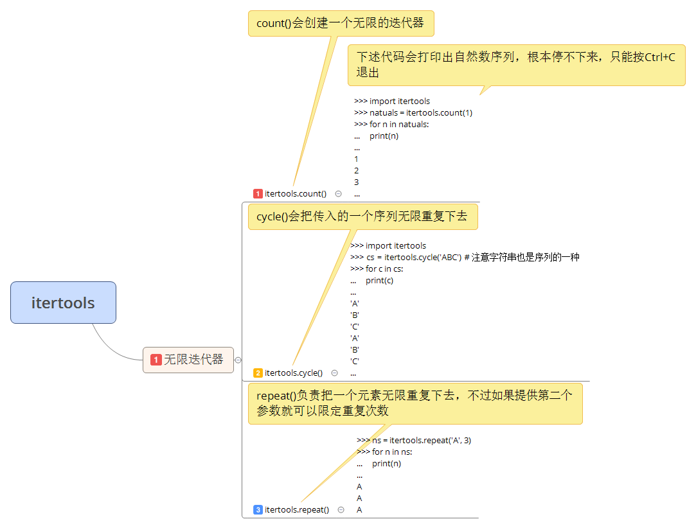

# 67.itertools

Python 的内建模块 itertools 提供了非常有用的用于操作迭代对象的函数。

## 迭代器

首先，我们看看 itertools 提供的几个 '无限' 迭代器：

````pyhton
>>> import itertools
>>> natuals = itertools.count(1)
>>> for n in natuals:
...     print(n)
...
1
2
3
...
````

因为count()会创建一个无限的迭代器，所以上述代码会打印出自然数序列，根本停不下来，只能按Ctrl+C退出。

cycle()会把传入的一个序列无限重复下去：

````python
>>> import itertools
>>> cs = itertools.cycle('ABC') # 注意字符串也是序列的一种
>>> for c in cs:
...     print(c)
...
'A'
'B'
'C'
'A'
'B'
'C'
...
````

同样停不下来。

repeat()负责把一个元素无限重复下去，不过如果提供第二个参数就可以限定重复次数：

````python
>>> ns = itertools.repeat('A', 3)
>>> for n in ns:
...     print(n)
...
A
A
A
````

无限序列只有在for迭代时才会无限地迭代下去，如果只是创建了一个迭代对象，它不会事先把无限个元素生成出来，事实上也不可能在内存中创建无限多个元素。

无限序列虽然可以无限迭代下去，但是通常我们会通过takewhile()等函数根据条件判断来截取出一个有限的序列：

````python
>>> natuals = itertools.count(1)
>>> ns = itertools.takewhile(lambda x: x <= 10, natuals)
>>> list(ns)
[1, 2, 3, 4, 5, 6, 7, 8, 9, 10]
````

itertools提供的几个迭代器操作函数更加有用：

## chain()

chain() 可以把一组迭代对象串联起来，形成一个更大的迭代器：

````python
>>> for c in itertools.chain('ABC', 'XYZ'):
...     print(c)
# 迭代效果：'A' 'B' 'C' 'X' 'Y' 'Z'
````

## groupby()

groupby()把迭代器中相邻的重复元素挑出来放在一起：

````python
>>> for key, group in itertools.groupby('AAABBBCCAAA'):
...     print(key, list(group))
...
A ['A', 'A', 'A']
B ['B', 'B', 'B']
C ['C', 'C']
A ['A', 'A', 'A']
````

实际上挑选规则是通过函数完成的，只要作用于函数的两个元素返回的值相等，这两个元素就被认为是在一组的，而函数返回值作为组的key。如果我们要忽略大小写分组，就可以让元素'A'和'a'都返回相同的key：

````python
>>> for key, group in itertools.groupby('AaaBBbcCAAa', lambda c: c.upper()):
...     print(key, list(group))
...
A ['A', 'a', 'a']
B ['B', 'B', 'b']
C ['c', 'C']
A ['A', 'A', 'a']
````

## 小结

itertools模块提供的全部是处理迭代功能的函数，它们的返回值不是list，而是Iterator，只有用for循环迭代的时候才真正计算。

[【参考源码】](https://github.com/michaelliao/learn-python3/blob/master/samples/commonlib/use_itertools.py) [【原文地址】](https://www.liaoxuefeng.com/wiki/0014316089557264a6b348958f449949df42a6d3a2e542c000/00143200162233153835cfdd1a541a18ddc15059e3ddeec000)

思维导图：


