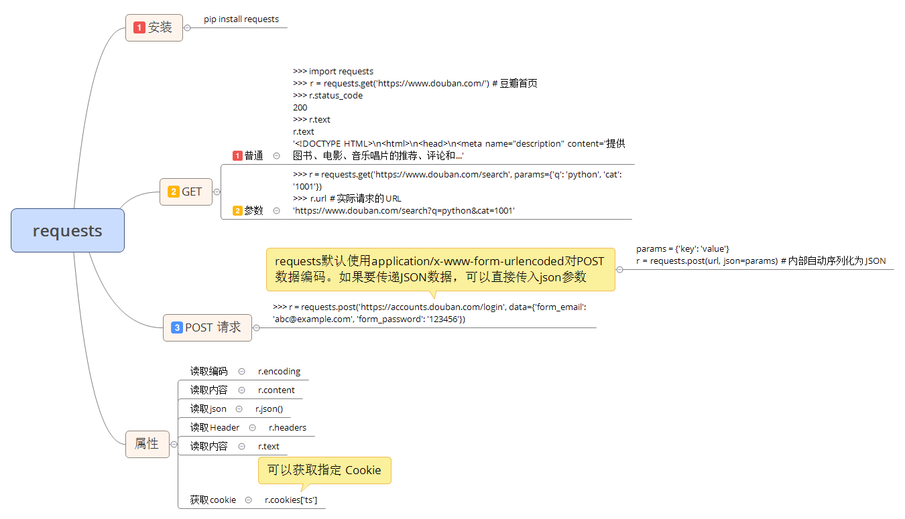

# 74.requests(url处理)

我们已经讲解了 Python 内置的 urllib 模块，用于访问网络资源。但是，它用起来比较麻烦，而且，缺少很多实用的高级功能。

更好的方案是使用 requests。它是一个 Python 第三方库，处理 URL 资源特别方便。

## 安装 requests

如果安装了 Anaconda，requests 就已经可用了。否则，需要在命令行下通过 pip 安装：

````python
$ pip install requests
````

如果遇到Permission denied安装失败，请加上sudo重试。

## 使用requests

要通过 GET 访问一个页面，只需要几行代码：

````python
>>> import requests
>>> r = requests.get('https://www.douban.com/') # 豆瓣首页
>>> r.status_code
200
>>> r.text
r.text
'<!DOCTYPE HTML>\n<html>\n<head>\n<meta name="description" content="提供图书、电影、音乐唱片的推荐、评论和...'
````

对于带参数的 URL，传入一个 dict 作为 params 参数：

````python
>>> r = requests.get('https://www.douban.com/search', params={'q': 'python', 'cat': '1001'})
>>> r.url # 实际请求的URL
'https://www.douban.com/search?q=python&cat=1001'
````

requests 自动检测编码，可以使用 encoding 属性查看：
````python
>>> r.encoding
'utf-8
````

无论响应是文本还是二进制内容，我们都可以用content属性获得bytes对象：

````python
>>> r.content
b'<!DOCTYPE html>\n<html>\n<head>\n<meta http-equiv="Content-Type" content="text/html; charset=utf-8">\n...'
````

requests 的方便之处还在于，对于特定的类型响应，例如 JSON，可以直接获取：

````python
>>> r = requests.get('https://query.yahooapis.com/v1/public/yql?q=select%20*%20from%20weather.forecast%20where%20woeid%20%3D%202151330&format=json')
>>> r.json()
{'query': {'count': 1, 'created': '2017-11-17T07:14:12Z', ...
````

需要传入 HTTP Header 时，我们传入一个 dict 作为 headres 参数：

````python
>>> r = requests.get('https://www.douban.com/', headers={'User-Agent': 'Mozilla/5.0 (iPhone; CPU iPhone OS 11_0 like Mac OS X) AppleWebKit'})
>>> r.text
'<!DOCTYPE html>\n<html>\n<head>\n<meta charset="UTF-8">\n <title>豆瓣(手机版)</title>...'
````

要发送 POST 请求，只需要把 get() 方法变成 post()，然后传入 data 参数作为 POST 请求的数据：
````python
>>> r = requests.post('https://accounts.douban.com/login', data={'form_email': 'abc@example.com', 'form_password': '123456'})
````

类似的，上传文件需要更复杂的编码格式，但是requests把它简化成files参数：

````python
>>> upload_files = {'file': open('report.xls', 'rb')}
>>> r = requests.post(url, files=upload_files)
````

在读取文件时，注意务必使用'rb'即二进制模式读取，这样获取的bytes长度才是文件的长度。

把 post() 方法替换为 put()，delete() 等，就可以以 PUT 或 DELETE 方式请求资源。

除了能轻松获取响应内容外，requests 对获取 HTTP 响应的其他信息也非常简单。例如 获取响应头：

````python
>>> r.headers
{Content-Type': 'text/html; charset=utf-8', 'Transfer-Encoding': 'chunked', 'Content-Encoding': 'gzip', ...}
>>> r.headers['Content-Type']
'text/html; charset=utf-8'
````

requests对Cookie做了特殊处理，使得我们不必解析Cookie就可以轻松获取指定的Cookie：

````python
>>> r.cookies['ts']
'example_cookie_12345'
````

要在请求中传入 Cookie ，只需准备一个 dict 传入 cookies 参数：

````python
>>> cs = {'token': '12345', 'status': 'working')
>>> r = requests.get(url, cookies=cs)
````

最后，要指定超时，传入以秒为单位的 timeout 参数：
````python
>>> r = requests.get(url, timeout=2.5) # 2.5秒后超时
````

## 总结

用requests获取URL资源，就是这么简单！

[【原文地址】](https://www.liaoxuefeng.com/wiki/0014316089557264a6b348958f449949df42a6d3a2e542c000/0015109021115795adfc5c8629f4f98985063b5a7e3ff87000)


思维导图：


