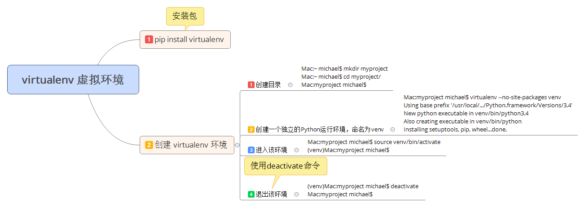

# 77.virtualenv 虚拟环境

在开发 Python 应用程序的时候，系统安装的 Python3 只有一个版本：3.4。所有第三方的包都会被 pip 安装到 Python3 的 site-packages 目录下。

如果我们同时开发多个应用程序，那这些应用程序目录都会共用一个Python，就是安装在系统的 Python 3 。如果应用 A 需要 jinja 2.7，而应用 B 需要 jinja 2.6怎么办？

这种情况下，每个应用可能需要各自拥有一套 '独立' 的 python 运行环境。virtualenv 就是用来为一个应用创建一套 '隔离' 的Python 运行环境。

首先，我们用 pip 安装 virtualenv：
````python
$ pip install virtualenv
````

然后，假定我们要开发一个新的项目，需要一套独立的Python运行环境，可以这么做：

第一步，创建目录：

````python
Mac:~ michael$ mkdir myproject
Mac:~ michael$ cd myproject/
Mac:myproject michael$
````

第二步，创建一个独立的Python运行环境，命名为venv：

````python
Mac:myproject michael$ virtualenv --no-site-packages venv
Using base prefix '/usr/local/.../Python.framework/Versions/3.4'
New python executable in venv/bin/python3.4
Also creating executable in venv/bin/python
Installing setuptools, pip, wheel...done.
````

命令 virtualenv 就可以创建一个独立的 Python 运行环境，我们还加上了参数 --no-site-packages，这样，已经安装到了系统的 Python 环境中的第三方包都不会复制过来，这样，我们就得到了一个不带任何第三方报的 '干净' 的Python 运行环境。

新建的Python环境被放到当前目录下的venv目录。有了venv这个Python环境，可以用source进入该环境：

````python
Mac:myproject michael$ source venv/bin/activate
(venv)Mac:myproject michael$
````

注意到命令行提示符变了，有个 (venv) 前缀，表示当前环境一个名为 venv 的Python 环境。

下面正常安装各种第三方包，并运行 python 命令：
````python
(venv)Mac:myproject michael$ pip install jinja2
...
Successfully installed jinja2-2.7.3 markupsafe-0.23
(venv)Mac:myproject michael$ python myapp.py
...
````
在venv环境下，用pip安装的包都被安装到venv这个环境下，系统Python环境不受任何影响。也就是说，venv环境是专门针对myproject这个应用创建的。

退出当前的 venv 环境，使用 deactivate 命令：
````python
(venv)Mac:myproject michael$ deactivate 
Mac:myproject michael$
````

此时就回到了正常的环境，现在pip或python均是在系统Python环境下执行。

完全可以针对每个应用创建独立的Python运行环境，这样就可以对每个应用的Python环境进行隔离。

virtualenv是如何创建“独立”的Python运行环境的呢？原理很简单，就是把系统Python复制一份到virtualenv的环境，用命令source venv/bin/activate进入一个virtualenv环境时，virtualenv会修改相关环境变量，让命令python和pip均指向当前的virtualenv环境。

## 总结
virtualenv为应用提供了隔离的Python运行环境，解决了不同应用间多版本的冲突问题。

[【原文地址】](https://www.liaoxuefeng.com/wiki/0014316089557264a6b348958f449949df42a6d3a2e542c000/001432712108300322c61f256c74803b43bfd65c6f8d0d0000)

## 思维导图


