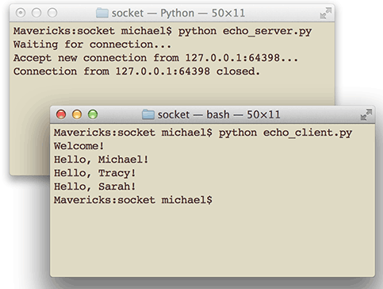
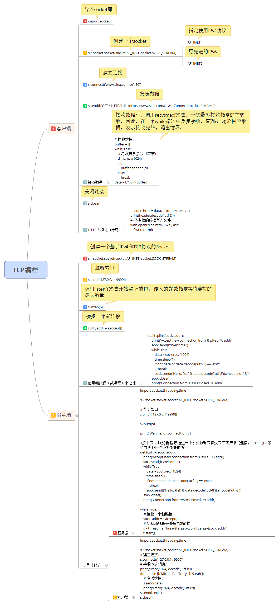

# 81.TCP编程

Socket是网络编程的一个抽象概念。通常我们用一个Socket表示 "打开了一个网络链接"，而打开一个Socket需要知道目标计算机的IP地址和端口号，再指定协议类型即可。

## 客户端

大多数连接都是可靠的 TCP 连接。创建 TCP l连接时，主动发起的连接的叫客户端，被动响应的连接叫服务器。

举个例子，当我们在浏览器访问新浪时，我们自己的计算器就是客户端，浏览器会主动向新浪服务器发起连接。如果一切顺利，新浪的服务器接受了我们的连接，一个 TCP 连接就建立起来了，后面的通信就是发送网页内容了。
所以，我们要创建一个基于 TCP 连接的 Socket，可以这样做：

````python
# 导入socket库:
import socket

# 创建一个socket:
s = socket.socket(socket.AF_INET, socket.SOCK_STREAM)
# 建立连接:
s.connect(('www.sina.com.cn', 80))
````
创建Socket时，AF_INET指定使用IPv4协议，如果要用更先进的IPv6，就指定为AF_INET6。SOCK_STREAM指定使用面向流的TCP协议，这样，一个Socket对象就创建成功，但是还没有建立连接。

客户端要主动发起TCP连接，必须知道服务器的IP地址和端口号。新浪网站的IP地址可以用域名www.sina.com.cn自动转换到IP地址，但是怎么知道新浪服务器的端口号呢？

答案是作为服务器，提供什么样的服务，端口号就必须固定下来。由于我们想要访问网页，因此新浪提供网页服务的服务器必须把端口号固定在80端口，因为80端口是Web服务的标准端口。其他服务都有对应的标准端口号，例如SMTP服务是25端口，FTP服务是21端口，等等。端口号小于1024的是Internet标准服务的端口，端口号大于1024的，可以任意使用。

因此，我们连接新浪服务器的代码如下：

````python
s.connect(('www.sina.com.cn', 80))
````

注意参数是一个tuple，包含地址和端口号。

建立TCP连接后，我们就可以向新浪服务器发送请求，要求返回首页的内容：

````python
# 发送数据:
s.send(b'GET / HTTP/1.1\r\nHost: www.sina.com.cn\r\nConnection: close\r\n\r\n')
````

TCP 连接创建的是双向同道，双方都可以同时给对方发送数据。但是谁先发谁后发，怎么协调，要根据具体的协议来决定。例如，HTTP 协议规定客户端必须先发请求给服务器，服务器收到后才发数据给客户端。

发送的文本格式必须符合 HTTP 标准，如果格式没问题，接下来就可以接收新浪服务器返回的数据了：
````python
# 接收数据:
buffer = []
while True:
    # 每次最多接收1k字节:
    d = s.recv(1024)
    if d:
        buffer.append(d)
    else:
        break
data = b''.join(buffer)
````

接收数据时，调用 recv(max) 方法，一次最多接收指定的字节数，因此，在一个 while 循环中反复接收，知道 recv() 返回空的数据，表示接收完毕，退出循环。

当我们接收完数据后，调用 close() 方法关闭 Socket，这样，一次完整的网络通信就结束了：

````python
# 关闭连接:
s.close()
````

接收的数据包括 HTTP 头和网页本身，我们只需要把 HTTP 头和网页分离一下，把 HTTP 头打印出来，网页内容保存到文件：
````python
header, html = data.split(b'\r\n\r\n', 1)
print(header.decode('utf-8'))
# 把接收的数据写入文件:
with open('sina.html', 'wb') as f:
    f.write(html)
````

现在，只需要在浏览器中打开这个sina.html文件，就可以看到新浪的首页了。

## 服务器
和客户端编程相比，服务器编程就要复杂一些。

服务器进程首先要绑定一个端口并监听来自其他客户端的连接。如果某个客户端连接过来了，服务器就与改客户建立 Socket 连接，随后的通信靠这个 Socket 连接了。

所以，服务器会打开固定端口 (比如 80) 监听，每一个客户端连接，就创建该 socket 连接。由于服务器会有大量来自客户端的连接，所以，服务器要能够区分一个 Socket 连接是和哪个客户端绑定的。**一个 Socket 依赖四项：服务器地址、服务器端口、客户端地址、客户端端口来唯一确定一个 Socket。**

但是服务器还需要同时响应多个客户端的请求，所以，每个连接都需要一个新的进程或者新的线程来处理，否则，服务器一次就只能服务一个客户端了。

我们来编写一个简单的服务器程序，它接收客户端连接，把客户端发多来的字符串加上 Hello 再发回去。

首先，创建一个基于 IPv4和TCP协议的Socket：
````python
s = socket.socket(socket.AF_INET, socket.SOCK_STREAM)
````

然后，我们要绑定监听的地址和端口。服务器可能有多块网卡，可以绑定到某一块网卡的 IP 地址上，也可以用 0.0.0.0 绑定到所有的网络地址上，还可以用 127.0.0.1 绑定到本机地址。127.0.0.1。127.0.0.1 是一个特殊的 IP 地址，表示本机地址，如果绑定到这个地址，客户端必须同时在本机才能连接，也就是说，外部的计算机无法连接进来。

端口号需要预先指定。因为我们写的这个服务不是标准服务，所以用 9999 这个端口号。请注意，小于 1024 的端口号必须要有管理员权限才能绑定：
````python
# 监听端口:
s.bind(('127.0.0.1', 9999))
````

紧接着，调用 listen() 方法开始监听端口，传入的参数指定等待的链接的最大数量：
````python
s.listen(5)
print('Waiting for connection...')
````

接下来，服务器程序通过一个永久循环来接受来自客户端的连接， accept() 会等待并返回一个客户端的连接：
````python
while True:
    # 接受一个新连接:
    sock, addr = s.accept()
    # 创建新线程来处理TCP连接:
    t = threading.Thread(target=tcplink, args=(sock, addr))
    t.start()
````

每个连接都必须创建新线程(或进程)来处理，否则，单线程在处理过程中，无法接受其他客户端的连接：
````python
def tcplink(sock, addr):
    print('Accept new connection from %s:%s...' % addr)
    sock.send(b'Welcome!')
    while True:
        data = sock.recv(1024)
        time.sleep(1)
        if not data or data.decode('utf-8') == 'exit':
            break
        sock.send(('Hello, %s!' % data.decode('utf-8')).encode('utf-8'))
    sock.close()
    print('Connection from %s:%s closed.' % addr)
````

连接建立后，服务首先发送一个欢迎信息，然后等待客户端数据，并加上 Hello 再发送给客户端。如果客户端发送了 exit 字符串，就直接关闭连接。

要测试这个服务器程序，我们还需要编写一个客户端程序：

````python
s = socket.socket(socket.AF_INET, socket.SOCK_STREAM)
# 建立连接:
s.connect(('127.0.0.1', 9999))
# 接收欢迎消息:
print(s.recv(1024).decode('utf-8'))
for data in [b'Michael', b'Tracy', b'Sarah']:
    # 发送数据:
    s.send(data)
    print(s.recv(1024).decode('utf-8'))
s.send(b'exit')
s.close()
````

我们需要打开两个命令行窗口，一个运行服务器程序，另一个运行客户端程序，就可以看到效果了：



需要注意的是，客户端程序运行完毕就退出了，而服务器程序会永远运行下去，必须按Ctrl+C退出程序。

## 小结
用TCP协议进行Socket编程在Python中十分简单，对于客户端，要主动连接服务器的IP和指定端口，对于服务器，要首先监听指定端口，然后，对每一个新的连接，创建一个线程或进程来处理。通常，服务器程序会无限运行下去。

同一个端口，被一个Socket绑定了以后，就不能被别的Socket绑定了。

[【参考源码】](https://github.com/michaelliao/learn-python3/tree/master/samples/socket) [【原文地址】](https://www.liaoxuefeng.com/wiki/0014316089557264a6b348958f449949df42a6d3a2e542c000/001432004374523e495f640612f4b08975398796939ec3c000#0)

## 导图地址

