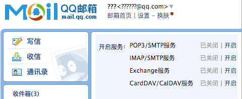

# 83.电子邮件

Email的历史比Web还要久远，直到现在，Email也是互联网上应用非常广泛的服务。

几乎所有的编程语言都支持发送和接收电子邮件，但是，先等等，在我们开始编写代码之前，有必要搞清楚电子邮件是如何在互联网上运作的。

我们来看看传统邮件是如何运作的。假设你现在在北京，要给一个香港的朋友发一封信，怎么做呢？

首先你得写好信，装进信封，写上地址，贴上邮票，然后就近找个邮局，把信仍进去。

信件会从就近的小邮局转运到大邮局，再从大邮局往别的城市发，比如先发到天津，再走海运到达香港，也可能走京九线到香港，但是你不用关心具体路线，你只需要知道一件事，就是信件走得很慢，至少要几天时间。

信件到达香港的某个邮局，也不会直接送到朋友的家里，因为邮局的叔叔是很聪明的，他怕你的朋友不在家，一趟一趟地白跑，所以，信件会投递到你的朋友的邮箱里，邮箱可能在公寓的一层，或者家门口，直到你的朋友回家的时候检查邮箱，发现信件后，就可以取到邮件了。

电子邮件的流程基本上也是按上面的方式运作的，只不过速度不是按天算，而是按秒算。

现在我们回到电子邮件，假设我们自己的电子邮件地址是me@163.com，对方的电子邮件地址是friend@sina.com（注意地址都是虚构的哈），现在我们用Outlook或者Foxmail之类的软件写好邮件，填上对方的Email地址，点“发送”，电子邮件就发出去了。这些电子邮件软件被称为MUA：Mail User Agent——邮件用户代理。

Email从MUA发出去，不是直接到达对方电脑，而是发到MTA：Mail Transfer Agent——邮件传输代理，就是那些Email服务提供商，比如网易、新浪等等。由于我们自己的电子邮件是163.com，所以，Email首先被投递到网易提供的MTA，再由网易的MTA发到对方服务商，也就是新浪的MTA。这个过程中间可能还会经过别的MTA，但是我们不关心具体路线，我们只关心速度。

Email到达新浪的MTA后，由于对方使用的是@sina.com的邮箱，因此，新浪的MTA会把Email投递到邮件的最终目的地MDA：Mail Delivery Agent——邮件投递代理。Email到达MDA后，就静静地躺在新浪的某个服务器上，存放在某个文件或特殊的数据库里，我们将这个长期保存邮件的地方称之为电子邮箱。

同普通邮件类似，Email不会直接到达对方的电脑，因为对方电脑不一定开机，开机也不一定联网。对方要取到邮件，必须通过MUA从MDA上把邮件取到自己的电脑上。

所以，一封电子邮件的旅程就是：
````
发件人 -> MUA -> MTA -> MTA -> 若干个MTA -> MDA <- MUA <- 收件人
````

有了上述基本概念，要编写程序来发送和接收邮件，本质上就是：

1. 编写MUA把邮件发到MTA；
2. 编写MUA从MDA上收邮件。

发邮件时，MUA和MTA使用的协议就是SMTP：Simple Mail Transfer Protocol，后面的MTA到另一个MTA也是用SMTP协议。

收邮件时，MUA和MDA使用的协议有两种：POP：Post Office Protocol，目前版本是3，俗称POP3；IMAP：Internet Message Access Protocol，目前版本是4，优点是不但能取邮件，还可以直接操作MDA上存储的邮件，比如从收件箱移到垃圾箱，等等。

邮件客户端软件在发邮件时，会让你先配置SMTP服务器，也就是你要发到哪个MTA上。假设你正在使用163的邮箱，你就不能直接发到新浪的MTA上，因为它只服务新浪的用户，所以，你得填163提供的SMTP服务器地址：smtp.163.com，为了证明你是163的用户，SMTP服务器还要求你填写邮箱地址和邮箱口令，这样，MUA才能正常地把Email通过SMTP协议发送到MTA。

类似的，从MDA收邮件时，MDA服务器也要求验证你的邮箱口令，确保不会有人冒充你收取你的邮件，所以，Outlook之类的邮件客户端会要求你填写POP3或IMAP服务器地址、邮箱地址和口令，这样，MUA才能顺利地通过POP或IMAP协议从MDA取到邮件。

在使用Python收发邮件前，请先准备好至少两个电子邮件，如xxx@163.com，xxx@sina.com，xxx@qq.com等，注意两个邮箱不要用同一家邮件服务商。

最后特别注意，目前大多数邮件服务商都需要手动打开SMTP发信和POP收信的功能，否则只允许在网页登录：


