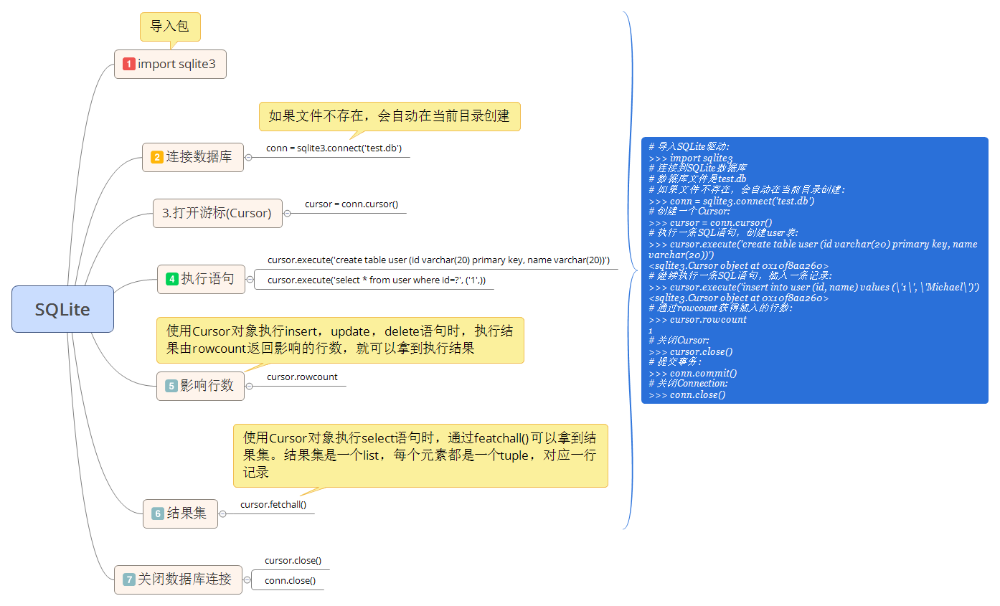

# 87.使用SQLite

SQLite是一种嵌入式数据库，它的数据库就是一个文件。由于SQLite本身是C写的，而且体积很小，所以，经常被集成到各种应用程序中，甚至在iOS和Android的App中都可以集成。

Python就内置了SQLite3，所以，在Python中使用SQLite，不需要安装任何东西，直接使用。

在使用SQLite前，我们先要搞清楚几个概念：

**表是数据库中存放关系数据的集合，一个数据库里面通常都包含多个表，比如学生的表，班级的表，学校的表，等等。表和表之间通过外键关联。**

要操作关系数据库，首先需要连接到数据库，一个数据库连接称为Connection；

连接到数据库后，需要打开游标，称之为Cursor，通过Cursor执行SQL语句，然后，获得执行结果。

Python定义了一套操作数据库的API接口，任何数据库要连接到Python，只需要提供符合Python标准的数据库驱动即可。

由于SQLite的驱动内置在Python标准库中，所以我们可以直接来操作SQLite数据库。

我们在Python交互式命令行实践一下：
````python
# 导入SQLite驱动:
>>> import sqlite3
# 连接到SQLite数据库
# 数据库文件是test.db
# 如果文件不存在，会自动在当前目录创建:
>>> conn = sqlite3.connect('test.db')
# 创建一个Cursor:
>>> cursor = conn.cursor()
# 执行一条SQL语句，创建user表:
>>> cursor.execute('create table user (id varchar(20) primary key, name varchar(20))')
<sqlite3.Cursor object at 0x10f8aa260>
# 继续执行一条SQL语句，插入一条记录:
>>> cursor.execute('insert into user (id, name) values (\'1\', \'Michael\')')
<sqlite3.Cursor object at 0x10f8aa260>
# 通过rowcount获得插入的行数:
>>> cursor.rowcount
1
# 关闭Cursor:
>>> cursor.close()
# 提交事务:
>>> conn.commit()
# 关闭Connection:
>>> conn.close()
````

我们再试试查询记录：
````python
>>> conn = sqlite3.connect('test.db')
>>> cursor = conn.cursor()
# 执行查询语句:
>>> cursor.execute('select * from user where id=?', ('1',))
<sqlite3.Cursor object at 0x10f8aa340>
# 获得查询结果集:
>>> values = cursor.fetchall()
>>> values
[('1', 'Michael')]
>>> cursor.close()
>>> conn.close()
````

使用Python的 DB-API 时，只要搞清楚 Connection 和 Cursor 对象，打开后一定记得关闭，就可以放心地使用。

使用 Cursor 对象执行 insert 、update、delete 语句时，执行结果由 rowcount 返回影响的行数，就可以拿到执行结果。

使用 Cursor 对象执行 select 语句时，通过 featchall() 可以拿到结果集。结果集是一个 list ，每个元素都是一个 tuple ，对应一行记录。

 如果SQL语句带有参数，那么需要把参数按照位置传递给execute()方法，有几个?占位符就必须对应几个参数，例如：
````python
cursor.execute('select * from user where name=? and pwd=?', ('abc', 'password'))
````
SQLite支持常见的标准SQL语句以及几种常见的数据类型。具体文档请参阅SQLite官方网站。

## 小结

在Python中操作数据库时，要先导入数据库对应的驱动，然后，通过Connection对象和Cursor对象操作数据。

要确保打开的Connection对象和Cursor对象都正确地被关闭，否则，资源就会泄露。

如何才能确保出错的情况下也关闭掉Connection对象和Cursor对象呢？请回忆try:...except:...finally:...的用法。

## 练习

请编写函数，在Sqlite中根据分数段查找指定的名字：

````python
# -*- coding: utf-8 -*-

import os, sqlite3

db_file = os.path.join(os.path.dirname(__file__), 'test.db')
if os.path.isfile(db_file):
    os.remove(db_file)

# 初始数据:
conn = sqlite3.connect(db_file)
cursor = conn.cursor()
cursor.execute('create table user(id varchar(20) primary key, name varchar(20), score int)')
cursor.execute(r"insert into user values ('A-001', 'Adam', 95)")
cursor.execute(r"insert into user values ('A-002', 'Bart', 62)")
cursor.execute(r"insert into user values ('A-003', 'Lisa', 78)")
cursor.close()
conn.commit()
conn.close()

def get_score_in(low, high):
    ' 返回指定分数区间的名字，按分数从低到高排序 '
----
    pass
----
# 测试:
assert get_score_in(80, 95) == ['Adam'], get_score_in(80, 95)
assert get_score_in(60, 80) == ['Bart', 'Lisa'], get_score_in(60, 80)
assert get_score_in(60, 100) == ['Bart', 'Lisa', 'Adam'], get_score_in(60, 100)

print('Pass')
````

[【参考源码】](https://github.com/michaelliao/learn-python3/blob/master/samples/db/do_sqlite.py) [【原文地址】](https://www.liaoxuefeng.com/wiki/0014316089557264a6b348958f449949df42a6d3a2e542c000/001432010494717e1db78cd172e4d52b853e7fd38d6985c000)


## sqlite 思维导图


