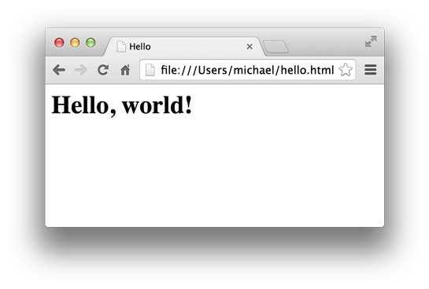
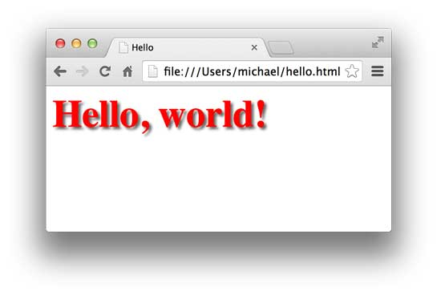

# 92.HTML简介

网页就是HTML？这么理解大概没错。因为网页中不但包含文字，还有图片、视频、Flash小游戏，有复杂的排版、动画效果，所以，HTML定义了一套语法规则，来告诉浏览器如何把一个丰富多彩的页面显示出来。

HTML长什么样？上次我们看了新浪首页的HTML源码，如果仔细数数，竟然有6000多行！

所以，学HTML，就不要指望从新浪入手了。我们来看看最简单的HTML长什么样：

````html
<html>
<head>
  <title>Hello</title>
</head>
<body>
  <h1>Hello, world!</h1>
</body>
</html>
````

可以用文本编辑器编写HTML，然后保存为hello.html，双击或者把文件拖到浏览器中，就可以看到效果：



HTML文档就是一系列的Tag组成，最外层的Tag是<html>。规范的HTML也包含<head>...</head>和<body>...</body>（注意不要和HTTP的Header、Body搞混了），由于HTML是富文档模型，所以，还有一系列的Tag用来表示链接、图片、表格、表单等等。

## CSS简介

CSS是Cascading Style Sheets（层叠样式表）的简称，CSS用来控制HTML里的所有元素如何展现，比如，给标题元素<h1>加一个样式，变成48号字体，灰色，带阴影：

````html
<html>
<head>
  <title>Hello</title>
  <style>
    h1 {
      color: #333333;
      font-size: 48px;
      text-shadow: 3px 3px 3px #666666;
    }
  </style>
</head>
<body>
  <h1>Hello, world!</h1>
</body>
</html>
````
效果如下：


## JavaScript简介

JavaScript虽然名称有个Java，但它和Java真的一点关系没有。JavaScript是为了让HTML具有交互性而作为脚本语言添加的，JavaScript既可以内嵌到HTML中，也可以从外部链接到HTML中。如果我们希望当用户点击标题时把标题变成红色，就必须通过JavaScript来实现：

````html
<html>
<head>
  <title>Hello</title>
  <style>
    h1 {
      color: #333333;
      font-size: 48px;
      text-shadow: 3px 3px 3px #666666;
    }
  </style>
  <script>
    function change() {
      document.getElementsByTagName('h1')[0].style.color = '#ff0000';
    }
  </script>
</head>
<body>
  <h1 onclick="change()">Hello, world!</h1>
</body>
</html>
````

点击标题后效果如下：



## 小结

如果要学习Web开发，首先要对HTML、CSS和JavaScript作一定的了解。HTML定义了页面的内容，CSS来控制页面元素的样式，而JavaScript负责页面的交互逻辑。

讲解HTML、CSS和JavaScript就可以写3本书，对于优秀的Web开发人员来说，精通HTML、CSS和JavaScript是必须的，这里推荐一个在线学习网站w3schools：

[http://www.w3schools.com/](http://www.w3schools.com/)

以及一个对应的中文版本：

[http://www.w3school.com.cn/](http://www.w3school.com.cn/)

当我们用Python或者其他语言开发Web应用时，我们就是要在服务器端动态创建出HTML，这样，浏览器就会向不同的用户显示出不同的Web页面。

[【原文地址】](https://www.liaoxuefeng.com/wiki/0014316089557264a6b348958f449949df42a6d3a2e542c000/0014320122322996f770fbf5da84ead84a1731e1dde129f000)
