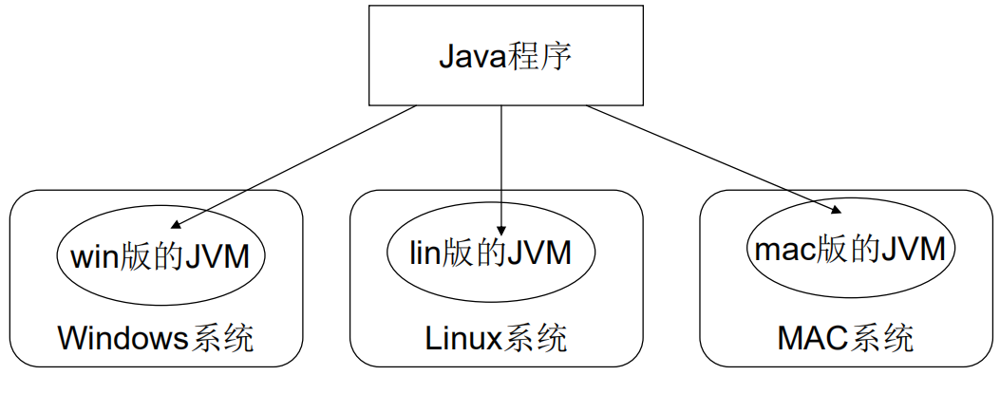

# 02-Java语言的跨平台原理(JVM)  
> 注解：跨平台就是操作系统

## 1.2.2 Java语言的特点：跨平台性
什么是跨平台性？
通过Java语言编写的应用程序在不同的系统平台上都可以运行。  
* **原理是什么？**  
只要在需要运行java应用程序的操作系统上，  
先安装一个Java虚拟机(JVM Java Virtual Machine)即可。  
由JVM来负责Java程序在该系统中的运行。

## 1.2.3 Java语言的特点：跨平台性(图解)
  
> 因为有了JVM，所以同一个Java程序在三个不同的操作系统中都
可以执行。这样就实现了Java程序的跨平台性。也称为Java具有
良好的可移植性。