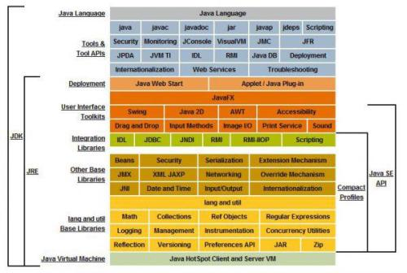

# 1.3 Java语言的环境搭建  
> 要运行一个语言，就要先搭建语言环境  
* 明确什么是JRE,JDK
* 下载JDK
* 安装JDK
* 配置环境变量
* 验证是否成功

## 1.3.1 什么是JRE,JDK?

* **JRE(Java Runtime Environment Java运行环境)-针对用户**  
包括Java虚拟机(JVM Java Virtual Machine)和Java程序所需的核心类
库等，如果想要运行一个开发好的Java程序，计算机中只需要安装JRE 
即可  
* **JDK(Java Development Kit Java开发工具包)-开发人员**  
JDK是提供给Java开发人员使用的，其中包含了java的开发工具，也包括了JRE。所以安装了JDK，就不用在单独安装JRE了。  
其中的开发工具：**编译工具(javac.exe)** **打包工具(jar.exe)**等

> 简单而言：使用JDK开发完成的java程序，交给JRE去运行。

总结：  
JRE:JVM+类库  
JDK:JRE+JAVA的开发工具

### Java 原理图  
