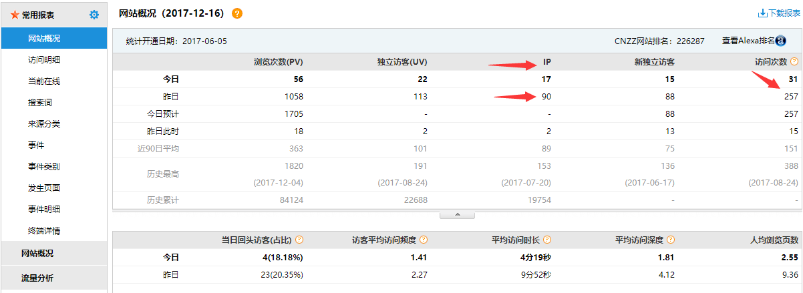
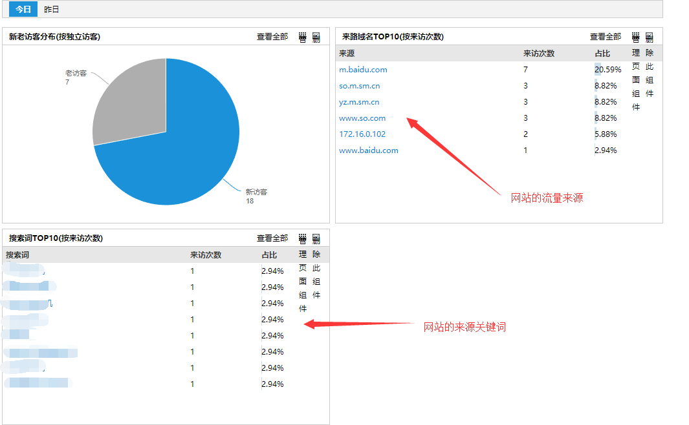
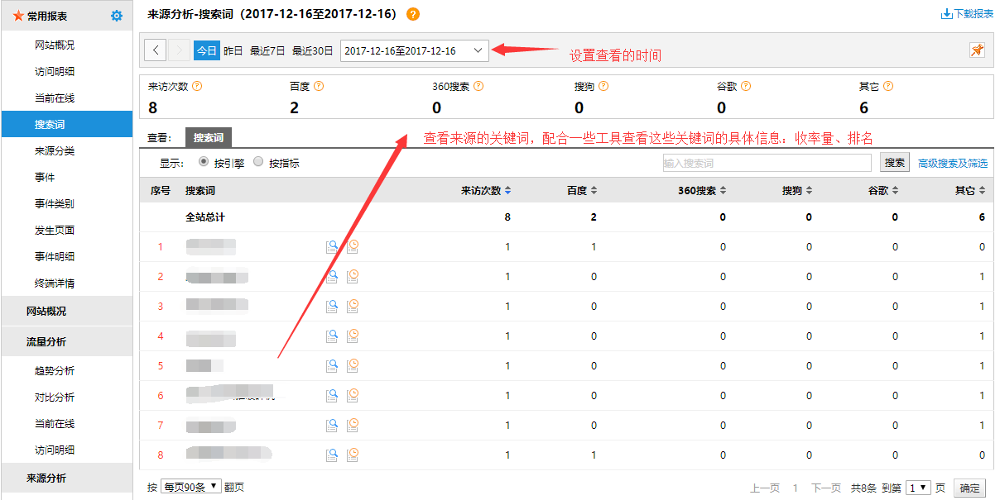

# 简介

## 1.CNZZ 查看项

### a.网站概况
- 查看网站的IP 如下图：

- 查看网站的流量来源

> 总结：对比 IP 查看流量是否减少，然后分析网站的搜索关键词与搜索来源

### b.访问明细：

栏目里面的内容可以查看用来是用什么方式来到网站的，是用搜索引擎还是直接访问，为了数据的准备性，需要在 CNZZ 屏蔽自己的IP

> 总结：查看网站访问的明细可以找出一规律的内容，目前已知的有：一个相同的IP 会有规律的访问 新闻列表，那肯定来偷文章的

### 搜索词

> 总结：查看具体搜索词，查看这些页面是否有问题，提高页面的用户体验，提升转化！！
